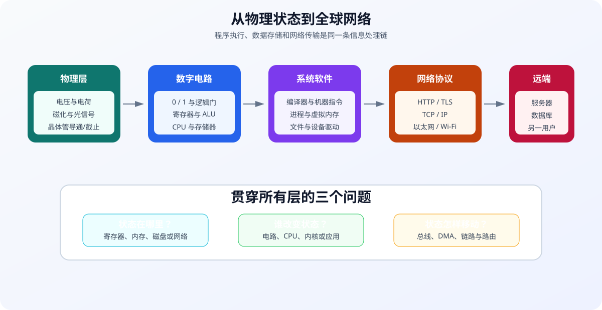
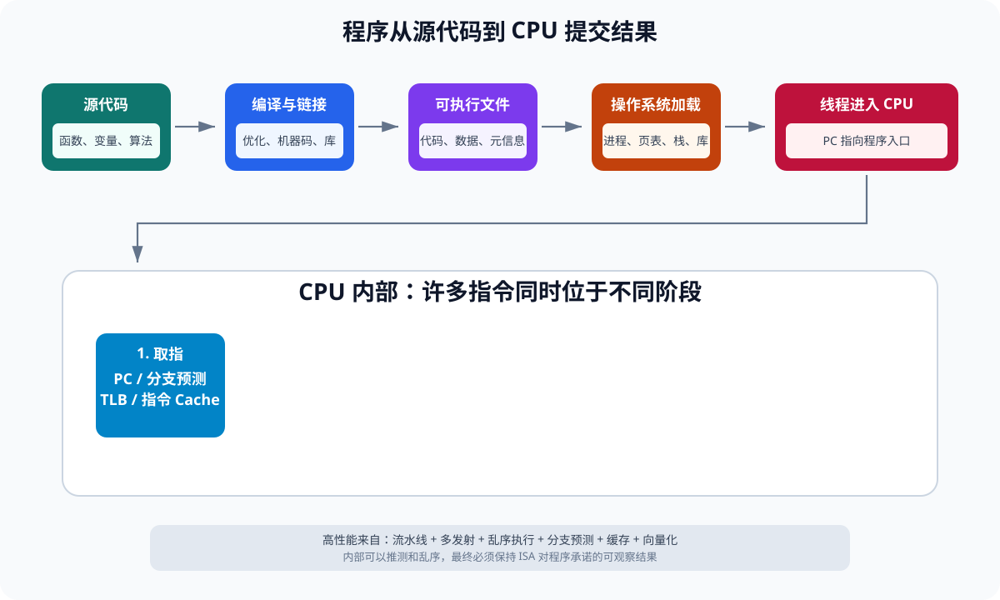
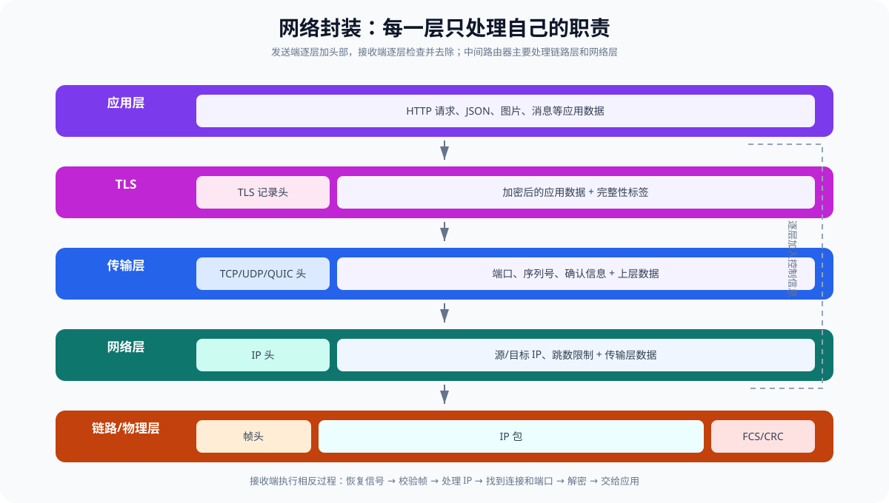
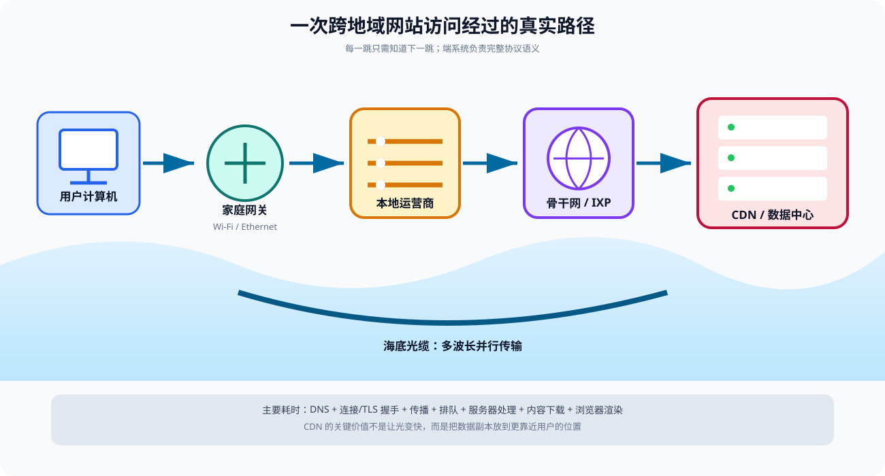
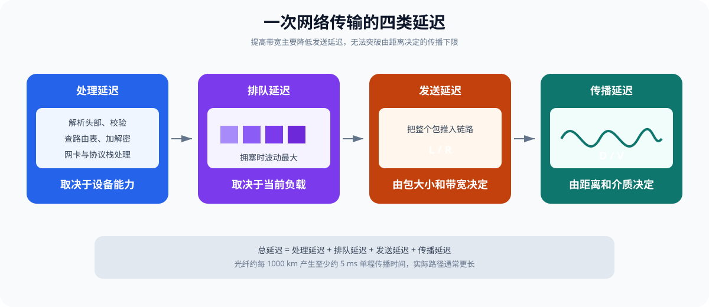

# 计算机底层原理：程序、数据与网络如何从 0 到 1 运转

> 本文试图回答三个看似简单、实际贯穿整个计算机科学的问题：
>
> 1. 一段程序究竟是怎样被执行的？
> 2. 文字、图片和程序究竟存在哪里，又是怎样保存的？
> 3. 数据怎样在极短时间内到达世界另一端？

答案不是“CPU 在计算”“硬盘在存储”“互联网在传输”这么简单。真实过程是一条跨越物理、电路、体系结构、操作系统和网络协议的长链：

```text
电子与电磁波
  ↓
晶体管与逻辑门
  ↓
寄存器、CPU、内存和设备
  ↓
机器指令与操作系统
  ↓
进程、文件与网络套接字
  ↓
网卡、交换机、路由器、光纤
  ↓
世界另一端的计算机执行相反过程
```

理解这条链以后，许多问题会自然得到答案：

- 为什么所有数据都能变成 `0` 和 `1`？
- 为什么 CPU 一秒可以执行几十亿个时钟周期？
- 为什么内存断电会丢数据，而 SSD 不会？
- 为什么同一个程序有时快、有时慢？
- 为什么北京访问上海通常比访问纽约快？
- 为什么“千兆宽带”不代表下载延迟只有千分之一秒？
- 为什么网络数据不会轻易发错机器或交给错误程序？

本文从物理世界出发，逐层建立抽象。阅读时不必一次记住所有术语，先抓住三条主线：

1. **状态**：信息当前保存在哪里？
2. **变换**：谁在按照什么规则改变信息？
3. **传输**：信息通过什么介质从哪里移动到哪里？



---

## 一、起点：计算机本质上是什么

从最底层看，计算机是一台能够自动完成以下循环的物理机器：

```text
读取状态 → 按规则计算 → 保存新状态 → 再读取
```

这里的“状态”可以是：

- 某根导线上的高低电压；
- 晶体管导通或截止；
- 寄存器里的 64 个二进制位；
- 内存某地址中的字节；
- SSD 浮栅中保存的电荷量；
- 网络链路上正在传播的电磁波；
- 操作系统记录的进程、文件和连接信息。

计算机并不理解“照片”“微信消息”或“程序”。它只是在物理定律允许的范围内，可靠地保存、变换和搬运状态。人类通过一层层编码规则，为这些状态赋予了意义。

### 1.1 为什么使用二进制

现实中的电压是连续的，例如可能是 `0.03 V`、`0.82 V` 或 `1.17 V`。如果直接要求电路精确区分无数电压，轻微噪声、温度变化和制造误差都会破坏结果。

数字电路把连续电压划分成两个容错区间：

```text
较低电压范围 → 逻辑 0
较高电压范围 → 逻辑 1
中间区域     → 不保证结果，应尽快越过
```

所以逻辑 `0` 和 `1` 不是“没有电”和“有电”的绝对描述，而是电路对物理信号的抽象解释。二进制的优势是：

- 两种状态容易制造和区分；
- 两个状态之间可以保留较大的噪声容限；
- 布尔代数能够完整描述二值逻辑；
- 存储、复制、校验和传输都容易工程化。

### 1.2 bit、Byte 和信息量

- `bit`（位）：一个二进制状态，取值为 `0` 或 `1`。
- `Byte`（字节）：通常为 8 bit，可表示 `2^8 = 256` 种组合。
- `KB/MB/GB/TB`：描述数据容量。
- `bit/s`：描述链路每秒传送多少位。

必须注意容量单位和网络速率单位：

```text
1 Byte = 8 bit
100 Mb/s 理论上最多约等于 12.5 MB/s
1 Gb/s  理论上最多约等于 125 MB/s
```

实际应用吞吐量还要扣除协议头、确认、重传和设备处理等开销。

### 1.3 位模式为什么能表示一切

一个位模式本身没有固有含义。例如：

```text
01000001
```

它可以被解释为：

- 无符号整数 `65`；
- ASCII 字符 `A`；
- 图片中的亮度；
- 某条机器指令的一部分；
- 压缩文件中的一个字节。

**数据 = 位模式 + 解释规则。**

文件格式、字符编码、机器指令集、网络协议，本质上都是对位模式解释规则的约定。

---

## 二、从电到逻辑：晶体管如何变成计算能力

### 2.1 晶体管是可控制的电子开关

现代数字芯片主要使用 MOSFET。可以先把它理解为有三个关键端子的开关：

- 栅极：控制端；
- 源极和漏极：电流通路的两端；
- 栅极电压达到条件时，源漏之间形成或关闭导电通道。

芯片通常使用 CMOS 技术，把 NMOS 与 PMOS 晶体管互补组合。最简单的 CMOS 反相器实现 NOT：

```text
输入低 → 上方晶体管导通 → 输出高
输入高 → 下方晶体管导通 → 输出低
```

理想静止状态下，CMOS 不需要持续让大量电流从电源流向地，因此能以较低静态功耗集成海量晶体管。实际仍有漏电和切换功耗。

### 2.2 从晶体管到逻辑门

组合不同晶体管，可以构造逻辑门：

| 逻辑门 | 规则 | 用途 |
| --- | --- | --- |
| NOT | 输入取反 | 反相 |
| AND | 全部为 1 才输出 1 | 条件同时成立 |
| OR | 至少一个为 1 就输出 1 | 条件至少成立一个 |
| XOR | 输入不同时输出 1 | 加法、奇偶校验 |
| NAND | AND 后取反 | 可构造任意布尔逻辑 |

例如，一位半加器只需两个核心表达式：

```text
和 Sum   = A XOR B
进位 Carry = A AND B
```

加入低位传来的进位 `Cin`，就得到全加器：

```text
Sum  = A XOR B XOR Cin
Cout = (A AND B) OR (Cin AND (A XOR B))
```

把 64 个全加器连接起来，就能计算 64 位加法。真实高性能加法器会用超前进位、前缀树等结构减少等待，而不是让进位简单地逐位爬过 64 级。

### 2.3 组合逻辑与时序逻辑

逻辑电路分为两大类：

**组合逻辑**

输出只由当前输入决定，例如加法器、比较器、译码器和多路选择器。

**时序逻辑**

输出还与过去状态有关，例如锁存器、触发器、寄存器、计数器和状态机。

如果只有组合逻辑，输入一消失，结果也随之消失。计算机之所以能“记住”，是因为反馈电路和存储器件可以维持状态。

### 2.4 时钟做了什么

同步数字电路使用周期性时钟信号协调大量状态更新：

```text
时钟边沿到来前：组合逻辑根据旧状态计算
时钟边沿到来时：寄存器锁存计算结果
下一个周期：新状态继续进入组合逻辑
```

假设 CPU 主频为 `3 GHz`：

```text
每秒约 30 亿个时钟周期
单个周期约 1 / 3,000,000,000 秒 ≈ 0.33 ns
```

但这不表示“一条指令固定耗时 0.33 ns”。一条指令可能跨越多个流水线阶段；反过来，现代 CPU 也可能在一个周期内完成多条指令。

### 2.5 为什么不能无限提高主频

CMOS 切换的动态功耗可粗略表示为：

```text
P_dynamic ≈ α × C × V² × f
```

其中：

- `α`：电路翻转活动率；
- `C`：等效电容；
- `V`：供电电压；
- `f`：时钟频率。

提高频率会增加功耗；为了支持更高频率，往往还需提高电压，而功耗与电压平方相关。功耗最终变成热量，散热能力限制了频率继续增长。导线延迟、晶体管切换时间和时钟偏斜也构成物理限制。

因此现代处理器更依赖多核、缓存、流水线、乱序执行、向量计算和专用加速器，而不是只提高频率。

---

## 三、数据如何编码：数字、文字、图片与声音

### 3.1 整数

一个 `n` 位无符号整数可表示：

```text
0 ～ 2^n - 1
```

8 位无符号整数：

```text
00000000 = 0
00000001 = 1
11111111 = 255
```

有符号整数通常使用补码。8 位补码范围为 `-128 ～ 127`：

```text
00000101 = +5
11111011 = -5
```

补码让同一套加法电路可以完成有符号和无符号加减。有限位宽意味着运算本质上是模运算，超出范围会截掉高位，所以程序必须关注整数溢出。

### 3.2 浮点数

IEEE 754 浮点数把有限位分成：

```text
符号位 | 指数 | 有效数
```

其基本思想类似科学计数法：

```text
(-1)^符号 × 有效数 × 2^指数
```

二进制浮点数只能精确表示有限位二进制小数。十进制 `0.1` 转成二进制是无限循环：

```text
0.1₁₀ = 0.0001100110011...₂
```

因此 `0.1 + 0.2` 的实际浮点结果可能略偏离 `0.3`。这不是 CPU 算错，而是有限编码对实数的近似。

### 3.3 字符和文本

Unicode 为字符分配码点，UTF-8 再把码点编码成一个或多个字节：

```text
A  → U+0041 → 41
中 → U+4E2D → E4 B8 AD
```

乱码通常意味着发送方和接收方使用了不同编码规则，而不是字节自己改变了。

### 3.4 图片

最简单的位图可以看成像素矩阵。每个像素记录红、绿、蓝等颜色通道：

```text
像素(x, y) = R + G + B + 可选透明度 A
```

例如 1920×1080、每像素 24 bit 的未压缩图片大约需要：

```text
1920 × 1080 × 24 / 8 ≈ 5.93 MB
```

PNG、JPEG 等格式用压缩规则减少重复或不重要的信息。解码器根据文件格式把字节重新还原为像素。

### 3.5 声音和视频

声音是连续空气振动。数字音频通过：

1. 按固定频率采样；
2. 把每次测得的振幅量化成整数；
3. 按格式编码和压缩。

例如 44.1 kHz 表示每秒采样 44100 次。视频则是一系列图像帧加音频，编码器利用帧内和帧间相似性压缩。

### 3.6 程序也是数据

机器指令同样被编码为字节。某段字节被 CPU 按 ISA 规则取出并译码时，它是“指令”；被文本编辑器查看时，它只是普通数据。

这就是“存储程序”思想：

> 指令和数据都能放在存储器中，区别在于 CPU 如何使用它们。

---

## 四、数据究竟如何被存住

“保存一个 bit”意味着让某种物理状态在一段时间内稳定存在，并且以后能够测出它。

不同存储介质选择了不同物理状态：

| 层级 | 典型介质 | 保存方式 | 断电后 |
| --- | --- | --- | --- |
| 寄存器 | 触发器 | 电路反馈状态 | 丢失 |
| SRAM Cache | 双稳态晶体管单元 | 电路反馈状态 | 丢失 |
| DRAM 内存 | 电容电荷 | 有/无或不同电荷 | 丢失，且需刷新 |
| NAND 闪存 | 浮栅/电荷俘获层 | 阈值电压区间 | 保留 |
| HDD | 磁性材料 | 磁化方向 | 保留 |
| 光盘 | 反射特征 | 凹坑或材料相变 | 保留 |


### 4.1 寄存器与 SRAM

CPU 寄存器通常由触发器构成，速度极快，但每 bit 需要较多晶体管，占用面积大。

CPU Cache 常使用 SRAM。典型 SRAM 单元利用多个晶体管形成双稳态结构：

```text
状态 A 会自我维持
状态 B 也会自我维持
读写线用于读取或强制改变状态
```

只要持续供电，状态就能保持，而且不需像 DRAM 那样周期刷新。代价是密度低、成本高。

### 4.2 DRAM

DRAM 单元通常可抽象为“一个电容加一个访问晶体管”：

- 电容有电荷或无电荷代表状态；
- 字线打开访问晶体管；
- 位线和感应放大器检测极小电压差；
- 读取具有破坏性，读后需要恢复；
- 电荷会泄漏，因此必须定期刷新。

DRAM 按通道、Rank、Bank、行、列组织。一次访问并非直接找到某个字节，而大致经历：

```text
激活一行 → 整行进入行缓冲区 → 选择列读写 → 必要时预充电并切换行
```

连续访问同一打开行通常更快；随机访问不同 Bank 和行会增加延迟。内存控制器会调度请求，以提高并行度和带宽利用率。

### 4.3 NAND 闪存与 SSD

闪存通过晶体管中保存的电子数量改变其阈值电压。控制器读取阈值电压区间，再解释成 bit：

- SLC：每单元 1 bit，2 个电压状态；
- MLC：每单元 2 bit，4 个状态；
- TLC：每单元 3 bit，8 个状态；
- QLC：每单元 4 bit，16 个状态。

每个单元保存的 bit 越多，容量越高，但电压区间更密，通常耐久性、速度和容错空间更差。

NAND 的关键限制是：

- 以页为单位读写；
- 不能随意原地覆盖，写前通常要按更大的块擦除；
- 擦写次数有限；
- 单元会出现错误和电荷漂移。

SSD 控制器因此需要：

- FTL：把操作系统逻辑块地址映射到实际闪存页；
- 垃圾回收：搬走有效页并擦除旧块；
- 磨损均衡：避免某些块过早损坏；
- ECC：检测和纠正位错误；
- 预留空间和坏块管理。

所以“把文件覆盖到原地址”通常只是操作系统看到的逻辑效果，底层数据可能写到了另一物理页。

### 4.4 HDD

HDD 在旋转盘片的磁性表面保存磁化状态。磁头移动到目标磁道，等待目标扇区转到磁头下方，再读写数据。

其延迟主要来自：

- 寻道时间；
- 旋转等待；
- 实际传输时间。

因此 HDD 顺序读写远快于大量小块随机读写。SSD 没有机械寻道，但仍受闪存、控制器和接口限制。

### 4.5 为什么需要存储层次

不存在同时满足“最快、最大、最便宜、永久保存”的单一介质。系统采用层次结构：

```text
寄存器
  ↓ 更大、更慢
L1 / L2 / L3 Cache
  ↓
DRAM
  ↓
SSD / HDD
  ↓
远程存储 / 备份
```

大致数量级会随硬件变化，但直觉可记为：

| 操作 | 粗略数量级 |
| --- | ---: |
| CPU 简单运算 | 亚纳秒到数纳秒 |
| L1 Cache | 约 1 ns |
| L2/L3 Cache | 数纳秒到数十纳秒 |
| DRAM | 数十到上百纳秒 |
| NVMe SSD | 数十到数百微秒 |
| HDD 随机访问 | 数毫秒 |
| 跨洲网络往返 | 数十到数百毫秒 |

这是一条巨大的时间鸿沟。若把一次 CPU 运算类比为 1 秒，那么一次磁盘随机访问可能像等待数周甚至数月。因此高性能系统的核心工作经常不是“让加法更快”，而是避免去更慢的层级等待。

---

## 五、文件如何从程序进入 SSD

假设程序执行：

```python
with open("hello.txt", "w", encoding="utf-8") as file:
    file.write("你好")
```

底层不会由 Python 直接操作闪存晶体管，而是层层委托：

```text
Python 运行时
  ↓
系统调用 write
  ↓
操作系统虚拟文件系统
  ↓
具体文件系统，如 NTFS/ext4/APFS
  ↓
页缓存与块 I/O 层
  ↓
存储设备驱动
  ↓
NVMe/SATA 控制器
  ↓
SSD 控制器、FTL、NAND 闪存
```

### 5.1 文件系统做什么

文件系统不只保存文件内容，还管理：

- 文件名和目录树；
- 文件大小、时间、权限；
- 文件数据位于哪些逻辑块；
- 空闲空间；
- 崩溃恢复所需的日志或元数据。

“文件”是操作系统提供的逻辑抽象。设备看到的通常是块编号和读写命令，并不知道 `hello.txt` 是什么。

### 5.2 写入返回不一定等于永久落盘

为提高性能，操作系统通常先把数据写入内存页缓存，并把页面标记为“脏”，稍后批量写入设备。

因此：

```text
write 返回
≠ 数据一定已经进入 NAND
≠ 突然断电后一定不会丢
```

需要持久性保证时，程序要使用 `fsync` 等机制，请求把相关数据和必要元数据推进到稳定存储。即便如此，最终保证还依赖设备是否正确处理缓存刷新和掉电保护。

### 5.3 删除文件发生了什么

一般删除首先移除目录项或释放文件占用的逻辑块，并不立即逐 bit 擦除所有物理内容。SSD 还存在 FTL、垃圾回收和 TRIM，因此“逻辑上已删除”与“所有物理残留已不可恢复”不是同一件事。

---

## 六、程序从源代码变成可执行文件

人类编写：

```c
int add(int a, int b) {
    return a + b;
}
```

CPU 并不认识 `int`、函数名和花括号。以传统编译语言为例，转换链路是：

```text
源代码
  ↓ 预处理
展开头文件、宏、条件编译
  ↓ 编译
词法/语法/语义分析、优化、生成汇编或中间代码
  ↓ 汇编
汇编指令编码为机器码，生成目标文件
  ↓ 链接
合并目标文件和库，解析符号、重定位地址
  ↓
可执行文件
```

编译器最终可能生成类似的概念指令：

```asm
ADD result_register, arg_register_1, arg_register_2
RET
```

具体机器字节由 ISA 决定。x86-64、ARM64 和 RISC-V 使用不同指令编码，同一个可执行文件通常不能直接跨 ISA 运行。

### 6.1 ISA：软件与 CPU 的契约

指令集体系结构（ISA）规定：

- 指令如何编码、分别做什么；
- 有哪些软件可见寄存器；
- 支持哪些数据类型和寻址方式；
- 内存访问、异常、中断如何表现；
- 原子操作和内存顺序规则。

微体系结构则回答“某一款 CPU 内部如何高效实现这套契约”。两款 CPU 可以都运行 x86-64 程序，但内部缓存、流水线和执行单元完全不同。

### 6.2 解释器、字节码和 JIT

并非所有语言都直接提前生成本机机器码：

- Python 解释器读取字节码，并由解释器的机器指令完成实际工作；
- Java/C# 常先生成虚拟机字节码；
- JIT 在运行时把热点代码编译成本机机器码；
- JavaScript 引擎混合解释、分析和 JIT 优化。

无论经过多少层，CPU 最终执行的仍是当前 ISA 的机器指令。

---

## 七、双击程序之后发生了什么

以启动一个可执行程序为例，操作系统大致执行：

1. 检查文件格式、权限和体系结构；
2. 创建进程及内核管理结构；
3. 建立新的虚拟地址空间；
4. 把程序代码、只读数据、可写数据映射进去；
5. 映射动态链接库；
6. 创建用户栈，放入参数和环境变量；
7. 准备堆区域、线程状态和标准输入输出；
8. 把 CPU 寄存器中的指令指针设为程序入口；
9. 调度该线程运行。

### 7.1 进程不是“运行中的文件”这么简单

进程是操作系统对运行程序的资源容器，通常拥有：

- 独立虚拟地址空间；
- 一个或多个线程；
- 打开的文件和网络连接；
- 安全令牌、用户身份和权限；
- 信号、句柄、计时器等内核状态。

线程是实际被调度到 CPU 上执行的指令流。多个线程可以共享同一进程的内存和资源。

### 7.2 虚拟地址不等于物理位置

程序看到的是虚拟地址，例如：

```text
0x00007FF6...
```

CPU 的 MMU 使用页表把虚拟页映射到物理页框。地址转换结果会缓存在 TLB 中：

```text
虚拟地址 = 虚拟页号 + 页内偏移
                  ↓ 查 TLB/页表
物理地址 = 物理页框号 + 原页内偏移
```

虚拟内存带来：

- 进程隔离；
- 读、写、执行权限控制；
- 统一连续的地址视图；
- 按需分配；
- 文件映射和共享内存；
- 写时复制。

### 7.3 缺页异常

若页表中暂时没有可用映射，CPU 会触发缺页异常，进入内核。操作系统可能：

- 分配一个全零物理页；
- 从可执行文件或映射文件读取页面；
- 从交换空间换入页面；
- 为写时复制创建私有副本；
- 判定访问非法并终止进程。

缺页异常是虚拟内存的正常组成部分，不一定是程序错误。

### 7.4 用户态与内核态

普通程序运行在受限的用户态，不能直接：

- 修改页表；
- 任意读写磁盘和网卡寄存器；
- 关闭中断；
- 访问其他进程内存。

程序通过系统调用请求内核服务。CPU 执行专用指令后：

```text
保存用户态必要现场
→ 切换到更高特权级
→ 跳入预先规定的内核入口
→ 内核检查参数和权限
→ 完成操作
→ 恢复并返回用户态
```

特权隔离是系统稳定性和安全性的基础。

---

## 八、CPU 如何执行一条指令

最简单的教学模型把执行拆成五步：

```text
取指 IF → 译码 ID → 执行 EX → 访存 MEM → 写回 WB
```



### 8.1 取指

程序计数器 `PC/IP` 保存下一条指令地址。CPU：

1. 用虚拟地址查询 TLB；
2. 查询 L1 指令缓存；
3. 命中则取得指令字节；
4. 未命中则请求更低级缓存或内存；
5. 预测下一条取指地址。

### 8.2 译码

译码器从机器字节识别：

- 操作码；
- 源寄存器和目标寄存器；
- 立即数；
- 是否读写内存；
- 是否跳转。

复杂 x86 指令常被转换成内部微操作，后续执行核心处理的是这些更规则的微操作。

### 8.3 读取操作数与寄存器重命名

CPU 从寄存器或指令立即数字段取得输入。高性能 CPU 会做寄存器重命名，把 ISA 中数量有限的逻辑寄存器映射到更多物理寄存器，消除“名字相同但数据并不依赖”的假依赖。

### 8.4 执行

不同执行单元负责不同任务：

- ALU：整数加减、位运算、比较；
- 乘除单元：整数乘除；
- FPU：浮点计算；
- SIMD/向量单元：一条指令并行处理多个元素；
- 地址生成单元：计算内存地址；
- Load/Store 单元：读写缓存；
- 分支单元：判断跳转方向和目标。

### 8.5 访存

Load/Store 指令先访问 L1 数据缓存。CPU 通常以缓存行为单位在缓存层次间搬运数据，常见缓存行大小为 64 Byte。

地址常被拆成：

```text
Tag | Set Index | Block Offset
```

Cache 用组索引找到候选位置，用 Tag 判断目标缓存行是否在其中，再用偏移选出所需字节。

### 8.6 写回与提交

执行结果先写入物理寄存器或相关缓冲区。现代乱序处理器最终按程序顺序提交：

- 提交前，推测结果还可以被取消；
- 提交后，结果成为体系结构可见状态；
- 若更早指令发生异常，后续指令不应看起来已经生效。

按序提交让 CPU 同时拥有内部乱序效率和外部顺序语义。

---

## 九、CPU 为什么算得这么快

CPU 的速度不是来自单一原因，而是多种机制叠加。

### 9.1 极短的物理距离

芯片内部关键部件相距毫米甚至微米。信号不需要跨越机械结构和长距离线路。尽管芯片导线中的有效传播和门延迟不能忽略，但物理距离极短。

### 9.2 海量晶体管并行工作

现代高性能处理器包含数十亿乃至更多晶体管。它们不是排成一列逐个工作，而是大规模同时翻转：

- 一组电路取指；
- 一组电路译码；
- 多个执行单元同时运算；
- 缓存并行查找；
- 预取器提前搬运数据；
- 其他核心执行其他线程。

### 9.3 流水线

流水线类似生产线。若一条指令要经过多个阶段，CPU 不必等待它全部结束才开始下一条：

```text
周期 1：指令 A 取指
周期 2：A 译码，B 取指
周期 3：A 执行，B 译码，C 取指
```

流水线主要提高吞吐量，不一定同比降低单条指令延迟。

### 9.4 超标量与乱序执行

超标量处理器每周期可以取出、译码、发射和完成多条微操作。乱序调度会优先执行操作数已经准备好的工作：

```text
A：从内存读取，等待较久
B：依赖 A，必须等待
C：与 A、B 无关，可以先执行
```

CPU 先做 C，避免执行单元闲置，最后仍按原顺序提交。

### 9.5 分支预测和推测执行

遇到 `if` 或循环分支时，CPU 在条件尚未算出前预测下一条路径并继续工作：

- 猜对：节省等待；
- 猜错：清除错误路径工作，恢复正确路径，损失多个周期。

现代预测器利用历史行为、地址模式等信息，常能取得很高准确率。但难以预测的分支仍会显著拖慢程序。

### 9.6 Cache 与局部性

CPU 和 DRAM 的速度差距很大。Cache 把近期和附近的数据保存在离核心更近的位置，利用：

- 时间局部性：刚用过的数据可能再次使用；
- 空间局部性：刚访问地址附近的数据可能马上使用。

顺序扫描数组通常快于随机追逐指针，因为一次缓存行搬运能覆盖多个连续元素，预取器也更容易识别模式。

### 9.7 SIMD、GPU 和专用硬件

CPU 的向量指令可以一条命令处理多个数据。GPU 则使用大量较简单的并行执行单元，适合图形、矩阵和机器学习任务。视频编解码器、加密单元、NPU 等专用电路通过固定或半固定数据通路，以更低能耗获得高吞吐量。

### 9.8 快不等于所有操作都快

CPU 加法很快，但程序常在等待：

- Cache 未命中；
- DRAM；
- 分支预测失败；
- 锁；
- 缺页；
- SSD；
- 网络；
- 其他服务。

性能近似公式：

```text
CPU 时间 = 指令数 × 平均每条指令周期数 CPI / 时钟频率
```

真正优化要同时考虑算法、指令数、并行度、局部性和等待时间，不能只看 GHz。

---

## 十、操作系统如何让多个程序“同时运行”

CPU 核心在某一瞬间执行一个硬件线程的指令流。操作系统调度器把可运行线程分配到各核心：

```text
线程 A 运行一小段
→ 定时器中断
→ 内核保存 A 的寄存器
→ 恢复线程 B 的寄存器
→ B 继续运行
```

这叫上下文切换。切换本身有成本，还可能扰动 Cache 和 TLB。

多核机器可以真正同时执行多个线程；单核机器通过快速切换制造并发推进的效果。

### 10.1 中断

设备无需让 CPU 一直询问“完成了吗”。操作系统向设备发出工作后，CPU 可以执行其他任务。设备完成时发送中断：

```text
设备发出中断
→ CPU 暂停当前普通执行
→ 保存必要现场
→ 运行内核中断处理逻辑
→ 记录完成、唤醒等待线程
→ 返回原任务或调度其他任务
```

### 10.2 DMA

大量数据若由 CPU 一个字节一个字节搬运会很浪费。DMA 允许设备控制器直接在设备与内存之间传输：

1. CPU/驱动准备内存缓冲区；
2. 配置设备的地址、长度和方向；
3. 设备通过总线读写内存；
4. 完成后中断 CPU。

CPU 仍负责控制和协议，但不必亲自搬每个字节。

---

## 十一、网络的本质：远距离搬运编码后的 bit

网络通信仍然遵循同一原则：

```text
应用数据
→ 加上多层控制信息
→ 编码成物理信号
→ 沿介质传播
→ 远端恢复 bit
→ 逐层去掉控制信息
→ 交给目标应用
```

网络不是一根从你的电脑直连世界所有电脑的线，而是由终端、交换机、路由器、运营商网络、海底光缆、数据中心等组成的分组交换系统。

### 11.1 三种常见物理信号

**双绞线**

通过铜线中的差分电信号传输。接收端关心两根线之间的电压差，这能抵抗共同噪声。双绞结构还能减小电磁干扰。

**光纤**

发送端激光器把电信号调制为光脉冲，光在纤芯中传播；接收端光电探测器把光重新变成电信号。工程上会使用更复杂的调制、波分复用和相干检测，不只是简单“亮代表 1，灭代表 0”。

**无线**

天线把高频电信号转换为电磁波，通过改变载波的幅度、频率、相位或其组合编码数据。接收天线取得微弱信号，经放大、同步、解调和纠错恢复 bit。

### 11.2 信号并不是电子从中国跑到美国

铜缆中远距离传播的是电磁场和能量变化，而不是某个电子从发送端一路冲到接收端。导体中的电子漂移速度通常很慢，但电磁信号沿导线传播很快。

光纤中传播的是光信号。真空光速约为：

```text
c ≈ 299,792 km/s
```

光在玻璃中的速度较慢，常可粗略按约 `200,000 km/s` 理解，即约为真空光速的三分之二。

---

## 十二、网络为什么要分层

一个应用不应亲自处理激光器、无线调制、路由选择和丢包重传。网络通过分层隐藏复杂性。

常用的 TCP/IP 视角：

| 层次 | 典型协议/对象 | 解决的问题 |
| --- | --- | --- |
| 应用层 | HTTP、DNS、TLS、SSH | 应用如何表达请求和数据 |
| 传输层 | TCP、UDP、QUIC | 进程到进程传输、可靠性与拥塞控制 |
| 网络层 | IPv4、IPv6、ICMP | 跨网络寻址与路由 |
| 链路层 | Ethernet、Wi-Fi | 同一链路或局域网中的帧传输 |
| 物理层 | 铜缆、光纤、无线电 | bit 如何变成实际信号 |

每层只依赖下一层提供的能力，并为上一层提供抽象。

### 12.1 封装

假设浏览器发送一段 HTTP 数据，各层会添加自己的头部：

```text
[以太网头 [IP 头 [TCP 头 [TLS 记录 [HTTP 数据]]]]]
```

可简化理解为：

- HTTP 描述请求语义；
- TLS 提供加密、完整性与身份认证；
- TCP 提供可靠有序字节流；
- IP 负责跨网络转发；
- 以太网/Wi-Fi 负责当前一跳；
- 物理层把整个帧编码成信号。

路由器通常移除收到的链路层头部，检查 IP 头，再为下一段链路构造新的链路层帧。IP 包在端到端路径中继续前进，但每一跳的链路帧会变化。



---

## 十三、访问一个网站的端到端全过程

假设在浏览器输入：

```text
https://www.example.com/
```

### 13.1 第一步：解析 URL

浏览器识别：

- 协议：`https`；
- 主机名：`www.example.com`；
- 默认端口：`443`；
- 路径：`/`。

### 13.2 第二步：DNS 查询 IP 地址

网络层使用 IP 地址转发，域名需要先解析。浏览器和操作系统依次检查缓存；若没有，则向递归 DNS 解析器查询。

解析器可能继续询问：

```text
根 DNS
→ 顶级域 .com DNS
→ example.com 权威 DNS
→ 得到 A/AAAA 记录
```

实际过程会大量使用缓存，因此通常不必每次完整查询。

### 13.3 第三步：确定下一跳

操作系统根据路由表判断目标是否在本地网络：

- 同一子网：直接发送给目标；
- 不同网络：发送给默认网关。

在以太网中，还需通过 ARP（IPv4）或邻居发现（IPv6）获得下一跳 IP 对应的链路层地址。

重要区别：

- IP 地址用于跨网络端到端寻址；
- MAC 地址主要用于当前链路上的一跳交付；
- 每经过路由器，下一跳链路地址通常都会改变。

### 13.4 第四步：建立传输连接

传统 HTTPS 常先建立 TCP 连接。TCP 三次握手：

```text
客户端 → SYN       → 服务端
客户端 ← SYN + ACK ← 服务端
客户端 → ACK       → 服务端
```

握手让双方确认通信能力、初始序列号和选项。现代实现可能将最后一个 ACK 与应用数据结合发送。

HTTP/3 使用 QUIC，它基于 UDP 在用户态实现可靠传输，并把传输握手与 TLS 1.3 更紧密地结合。

### 13.5 第五步：TLS 握手

HTTPS 还需要建立安全会话：

1. 协商 TLS 版本和算法；
2. 服务端发送证书；
3. 客户端验证域名、证书链、有效期等；
4. 双方通过密钥交换导出会话密钥；
5. 后续应用数据使用对称加密并进行完整性保护。

公钥密码主要用于身份认证和安全建立密钥；大量数据传输使用更高效的对称加密。

### 13.6 第六步：发送 HTTP 请求

浏览器构造请求，例如：

```http
GET / HTTP/1.1
Host: www.example.com
Accept: text/html
```

数据经过 TLS、TCP/IP 和链路层封装后，被写入网卡发送队列。

### 13.7 第七步：网卡发送

网卡通常通过 DMA 从内存读取待发送数据：

1. 应用通过系统调用把数据交给内核；
2. 内核协议栈构造传输层和网络层信息；
3. 驱动准备描述符；
4. 网卡通过 DMA 读取缓冲区；
5. 网卡完成校验和、分段等可卸载工作；
6. PHY 把 bit 编码为电、光或无线信号。

### 13.8 第八步：交换机和路由器逐跳转发

家庭交换机或无线接入点先按链路层规则转发。路由器收到 IP 包后：

1. 校验并解析必要头部；
2. 递减 TTL/Hop Limit，避免包无限循环；
3. 查询转发表，选择下一跳和出口；
4. 排队等待出口链路；
5. 用下一跳链路格式重新封装并发送。

运营商骨干网中的高速路由器使用专用 ASIC，并通过 TCAM、分层转发表、高速交换结构等机制实现极高包转发率。

### 13.9 第九步：跨越长距离光纤

数据可能经过：

- 本地接入网；
- 城域网；
- 运营商骨干网；
- 互联网交换中心或对等互联；
- 海底光缆；
- 目标地区运营商；
- 数据中心边界和内部网络。

光纤链路可使用波分复用，让不同波长在同一根光纤中同时承载多路高速信号。中继设备会对长距离衰减进行光放大或重新处理。

### 13.10 第十步：服务器接收并处理

远端网卡把信号恢复为帧，通过 DMA 写入内存并通知 CPU。内核协议栈：

- 检查链路层和 IP 信息；
- 根据 IP、端口和连接状态找到对应套接字；
- 处理乱序、确认、重传和解密所需数据；
- 唤醒服务器进程。

Web 服务器读取请求，执行业务逻辑，可能访问缓存、数据库和其他服务，再沿相反方向发送响应。

### 13.11 第十一步：浏览器渲染

浏览器收到 HTML 后还会：

1. 解析 HTML，构建 DOM；
2. 下载 CSS、JavaScript、字体和图片；
3. 解析 CSS，构建样式规则；
4. 计算布局；
5. 绘制和合成图层；
6. 由 GPU/显示系统生成画面；
7. 显示器驱动像素发光。

因此“网站打开速度”是 DNS、连接、加密、网络、服务器、资源数量和浏览器渲染共同作用的结果。



---

## 十四、TCP 如何让不可靠网络看起来可靠

IP 尽力而为地转发包，但不保证：

- 一定到达；
- 按顺序到达；
- 不重复；
- 延迟固定。

TCP 在端系统中增加可靠性。

### 14.1 序列号和确认

TCP 把字节流编号。接收端通过 ACK 告诉发送端“下一个期望字节编号”。若数据丢失，发送端可根据超时或重复 ACK 重传。

### 14.2 校验和

校验和用于发现传输中的某些位错误。链路层也常有 CRC。检测到损坏后通常丢弃，再由上层重传。

校验和不是加密，不能防止攻击者有意篡改后重新计算。安全完整性由 TLS 等密码学机制提供。

### 14.3 滑动窗口

若每发送一小段数据都等待一次往返确认，长距离链路会严重闲置。TCP 允许窗口内多个字节在未确认状态下同时传输：

```text
在途数据量 ≈ 带宽 × 往返时延 RTT
```

这叫带宽时延积。例如 `1 Gb/s`、RTT `100 ms` 的路径，要充分利用链路，理论在途数据约为：

```text
1,000,000,000 bit/s × 0.1 s = 100,000,000 bit ≈ 12.5 MB
```

窗口过小，即使链路很快也跑不满。

### 14.4 流量控制

接收端通告接收窗口，防止发送端速度超过接收缓冲区处理能力。

### 14.5 拥塞控制

网络中很多连接共享链路和路由器队列。发送端根据丢包、延迟或显式信号估计网络承载能力，动态调整发送速率。

流量控制保护接收端；拥塞控制保护网络，两者不是同一件事。

### 14.6 TCP 为什么有队头阻塞

TCP 向应用提供有序字节流。如果较早的一段丢失，即使后续数据已到达，应用通常也必须等待缺失部分重传。QUIC 让多个逻辑流相对独立，减少一个流丢包阻塞其他流的问题，但同一流内仍需保持语义所需顺序。

---

## 十五、为什么数据能传得这么快

“网络快”至少包含四个完全不同的量：

| 概念 | 问题 | 常用单位 |
| --- | --- | --- |
| 传播速度 | 一个信号前沿移动多快 | km/s |
| 带宽/链路速率 | 每秒能注入多少 bit | Mb/s、Gb/s |
| 延迟 | 一份数据从起点到终点要多久 | ms |
| 吞吐量 | 应用实际每秒收到多少有效数据 | MB/s、Gb/s |

### 15.1 传播速度快

电磁相互作用和光在介质中传播极快。光纤内可粗略按 `200,000 km/s` 估算：

```text
每 1000 km 单程纯传播时间至少约 5 ms
```

若光纤实际路径为 12000 km，仅物理传播的理论单程时间就约：

```text
12000 / 200000 = 0.06 s = 60 ms
```

往返至少约 120 ms，还未包含设备、排队和绕路。这说明跨洲延迟不可能仅靠升级 CPU 降到 1 ms，物理距离给出了硬下限。

### 15.2 带宽高

“传播快”不代表“单位时间数据多”。一辆卡车速度不变，却可以通过增加车道提高总运输量。通信系统通过以下手段提高带宽：

- 更高符号率；
- 一个符号编码多个 bit；
- 多对铜线或多空间流；
- 多根光纤；
- 波分复用；
- 更宽无线频谱；
- 更高信噪比下的高级调制；
- 并行链路和多路径。

香农容量给出了带宽、信噪比和最大可靠信息速率之间的理论关系：

```text
C = B × log₂(1 + S/N)
```

其中 `B` 是信道带宽，`S/N` 是信噪比。它说明容量不能脱离物理带宽和噪声无限增长。

### 15.3 硬件流水线和并行转发

高速网卡、交换机和路由器不靠通用 CPU 为每个 bit 执行一套复杂程序，而使用专用流水线 ASIC：

```text
解析头部
→ 查转发表
→ 应用策略
→ 修改头部
→ 排队
→ 发送
```

多级流水线可以同时处理不同数据包。设备还使用多个端口、队列和并行交换结构提高总吞吐量。

### 15.4 缓存和 CDN 把内容搬近

访问海外源站慢，最有效的优化往往不是让光传播更快，而是让内容更靠近用户：

- DNS 把用户引导到附近节点；
- CDN 边缘缓存静态资源；
- 服务在多个地区部署；
- 浏览器和代理缓存已访问内容；
- 长连接和会话恢复减少握手。

距离缩短后，传播时延和中间跳数都下降。

### 15.5 压缩减少要传的 bit

若 10 MB 文本压缩到 2 MB，相同链路只需传输五分之一的数据。代价是两端需要压缩和解压计算。是否值得取决于数据可压缩性、CPU 成本和网络速度。

---

## 十六、延迟究竟由哪些部分组成

一个数据包经过一段链路的延迟可拆为：

```text
总延迟 = 处理延迟 + 排队延迟 + 发送延迟 + 传播延迟
```



### 16.1 处理延迟

网卡、交换机、路由器和终端解析头部、校验、查表、加解密所需时间。

### 16.2 排队延迟

出口链路忙时，数据包进入队列等待。轻载时可能很小，拥塞时会迅速增加并波动，队列满后还会丢包。

### 16.3 发送延迟

把一个长度为 `L` bit 的包完整推入速率为 `R bit/s` 的链路所需时间：

```text
发送延迟 = L / R
```

例如 1500 Byte 数据通过 100 Mb/s 链路：

```text
1500 × 8 / 100,000,000 ≈ 0.00012 s = 0.12 ms
```

### 16.4 传播延迟

信号跨越距离 `D`、介质传播速度为 `V`：

```text
传播延迟 = D / V
```

升级带宽可降低发送延迟，却几乎不能降低由地理距离决定的传播延迟。这是最常见的概念混淆之一。

### 16.5 RTT 和吞吐量

RTT 是一次往返时间。许多协议阶段需要等待一个或多个 RTT，因此：

- 减少握手轮次很重要；
- 复用连接很重要；
- 把服务部署得更近很重要；
- 并行请求不能突破所有依赖关系。

---

## 十七、接收方如何知道数据属于哪个程序

一台服务器可能同时有成千上万个连接。网络栈通过多层标识逐步分发：

```text
网卡：这个链路帧是否发给我？
IP 层：目标 IP 是否属于本机？
传输层：目标端口是什么？
连接表：属于哪个具体连接？
套接字：由哪个进程持有？
应用协议：这是哪个请求或会话？
```

TCP 连接通常由五元组区分：

```text
源 IP、源端口、目标 IP、目标端口、传输协议
```

因此大量客户端都可以连接同一个服务器的 `443` 端口，只要五元组不同，内核就能区分连接。

端口不是物理插孔，而是操作系统中的逻辑编号。套接字是程序使用网络服务的编程接口和内核对象。

---

## 十八、多核计算机如何保持数据一致

每个 CPU 核心通常有私有缓存。同一内存地址可能在多个核心的缓存中存在副本。

### 18.1 `count++` 为什么不安全

它通常不是不可分割的一步：

```text
读取 count
加 1
写回 count
```

两个核心都读到 `0`，分别算出 `1` 并写回，最终结果可能是 `1` 而不是 `2`。

### 18.2 缓存一致性

一致性协议以缓存行为单位协调副本。一个核心要写共享缓存行时，通常先取得所有权并让其他核心副本失效。MESI 一类协议会让缓存行在“修改、独占、共享、无效”等状态间变化。

### 18.3 一致性不等于线程安全

缓存一致性保证针对单个地址的副本协调，但不会自动把“读取、计算、写回”合成原子事务，也不一定保证多个地址按源码顺序被其他核心观察。

程序仍需使用：

- 锁；
- 原子变量；
- 信号量和条件变量；
- 语言内存模型规定的同步操作。

### 18.4 内存屏障和重排

编译器和 CPU 都可能在不改变单线程结果的前提下重排操作。同步原语会施加必要的顺序和可见性约束。业务代码应优先使用语言标准库，而不是自行拼接平台相关屏障。

---

## 十九、正确性与可靠性从哪里来

物理世界有噪声、干扰、制造缺陷和器件老化。计算机之所以可靠，是因为各层都有检测与恢复机制。

### 19.1 数字电路

- 电压噪声容限；
- 时序裕量；
- 时钟同步；
- 制造测试；
- 冗余和故障隔离。

### 19.2 存储

- 奇偶校验；
- ECC；
- SSD 坏块管理；
- RAID；
- 文件系统日志；
- 备份和多副本。

### 19.3 网络

- 物理层纠错编码；
- 以太网 CRC；
- IP/TCP/UDP 校验；
- TCP 重传；
- 路由冗余；
- 应用层哈希和签名。

### 19.4 安全

“没有传错”与“没有被攻击者篡改”是两种不同保证：

- 错误检测码主要应对随机错误；
- 消息认证码和数字签名应对恶意篡改；
- 加密保护机密性；
- 证书和信任链帮助验证对方身份；
- 权限、隔离和最小特权限制攻击影响。

---

## 二十、把全部过程串起来：发送一条消息

假设你在聊天软件输入“你好”并点击发送：

1. 键盘控制器检测按键，将事件交给操作系统。
2. 输入法把按键序列转换为 Unicode 字符。
3. 应用把字符按 UTF-8 等格式编码为字节。
4. 应用可能构造 JSON/Protobuf 消息，加上会话标识和时间。
5. TLS 把应用数据加密并添加完整性保护。
6. TCP 或 QUIC 对数据编号、分段并执行可靠传输和拥塞控制。
7. IP 层加上源、目标 IP 等信息。
8. 链路层构造发往当前下一跳的帧。
9. 内核驱动通知网卡，网卡通过 DMA 读取内存数据。
10. 网卡把 bit 调制成电、光或无线信号。
11. 信号到达路由器，数据包逐跳转发。
12. 运营商和骨干网把包送到服务端数据中心。
13. 服务端网卡把信号恢复为 bit，并通过 DMA 写入内存。
14. 服务端内核根据连接找到聊天服务进程。
15. 服务解密、鉴权、保存消息，并查找接收者连接。
16. 服务端沿另一条网络链路把消息推给接收者。
17. 接收方逐层解封装、校验和解密。
18. 应用把 UTF-8 字节解码成 Unicode 字符。
19. 字体引擎找到“你”“好”的字形，栅格化为像素。
20. GPU 合成画面，显示器刷新像素，接收者看到消息。

这 20 步中的许多步骤会并行、缓存、批处理或由硬件卸载，因此通常只需几十到几百毫秒。

---

## 二十一、常见误区

### 21.1 “CPU 频率 4 GHz，所以每秒执行 40 亿条指令”

不准确。频率是周期数，不是指令数。流水线、超标量、缓存未命中和指令复杂度都会改变每周期退休指令数。

### 21.2 “内存地址就是 DRAM 芯片上的固定格子”

程序使用虚拟地址；MMU 将其转换为物理地址；内存控制器还会把物理地址映射到通道、Bank、行、列。中间有多层映射。

### 21.3 “文件写成功就永久保存了”

写调用可能只进入内存缓存。持久性需要刷新、文件系统和设备共同提供保证。

### 21.4 “数据在网线里以 0 V 和 5 V 直接传 0/1”

真实物理层使用线路编码、差分信号、调制、均衡、时钟恢复和纠错等机制。逻辑 bit 与线上瞬时波形不是简单一一对应。

### 21.5 “光纤带宽越高，跨洋延迟就越低”

高带宽主要降低发送大量数据所需时间。跨洋传播延迟由距离和介质中的光速决定，不会因 1 Gb/s 升到 100 Gb/s 而按比例下降。

### 21.6 “互联网会为每个包预先建立一条物理线路”

互联网主要是分组交换。数据包共享链路，路由器逐跳转发，不需要为普通连接独占端到端物理线路。

### 21.7 “MAC 地址负责全球寻址”

MAC 地址主要服务于本地链路。跨网转发依赖 IP 和路由，每一跳的链路层地址可变化。

### 21.8 “TCP 保证消息边界”

TCP 提供有序字节流，不保留应用每次 `send` 的边界。应用协议必须自己定义长度字段、分隔符或固定格式。

### 21.9 “数据有 CRC，所以通信是安全的”

CRC 能检测随机传输错误，但攻击者可重新计算。防篡改需要密码学完整性机制。

### 21.10 “多核会自动让任何程序变快”

程序必须存在可并行部分，并支付线程调度、同步、通信和缓存一致性成本。串行部分仍限制总加速比。

---

## 二十二、如何判断程序慢在哪里

不要只凭感觉优化。按层排查：

### 22.1 CPU 计算

- 算法复杂度是否合理？
- 指令数是否过多？
- 是否存在难预测分支？
- 是否使用 SIMD？
- 是否被数据依赖限制？

### 22.2 存储系统

- Cache 未命中是否过多？
- 数据是否连续访问？
- 是否受 DRAM 延迟或带宽限制？
- 是否频繁缺页？
- 是否存在伪共享或 NUMA 远端访问？

### 22.3 文件与磁盘

- 是随机小 I/O 还是顺序大 I/O？
- 是否频繁同步刷盘？
- 队列是否拥塞？
- 是否可合理缓存或批处理？

### 22.4 网络

- DNS、建连、TLS 各耗时多少？
- RTT 有多大？
- 是否丢包或重传？
- 是带宽不足还是延迟过高？
- 服务端处理时间多长？
- 是否可使用连接复用、压缩、CDN 或就近部署？

### 22.5 并发

- 锁竞争是否严重？
- 线程是否过多导致切换？
- 队列是否形成背压？
- 下游服务是否成为瓶颈？

常用原则：

> 先测量，再定位；先优化占总时间最多的部分；优化后重新测量。

---

## 二十三、核心公式与数量级速查

### 23.1 CPU

```text
时钟周期 = 1 / 频率
CPU 时间 = 指令数 × CPI / 频率
```

### 23.2 数据容量与链路

```text
1 Byte = 8 bit
理想传输时间 = 数据量(bit) / 链路速率(bit/s)
```

### 23.3 网络延迟

```text
发送延迟 = 包长度 / 链路速率
传播延迟 = 距离 / 介质传播速度
总延迟 = 处理 + 排队 + 发送 + 传播
```

### 23.4 长肥网络

```text
带宽时延积 = 带宽 × RTT
```

它表示想要跑满链路，需要允许多少数据同时在网络中“飞行”。

### 23.5 并行加速上限

Amdahl 定律：

```text
Speedup = 1 / ((1 - P) + P / S)
```

`P` 是可加速比例，`S` 是该部分加速倍数。无法并行或无法优化的部分最终决定上限。

---

## 二十四、从 0 到 1 的学习路线

建议按以下顺序继续深入：

```text
第一阶段：二进制、补码、浮点数、字符编码
  ↓
第二阶段：晶体管、逻辑门、组合逻辑、时序逻辑
  ↓
第三阶段：寄存器、ALU、数据通路、指令集、汇编
  ↓
第四阶段：流水线、乱序执行、Cache、DRAM
  ↓
第五阶段：进程、虚拟内存、系统调用、文件系统、I/O
  ↓
第六阶段：以太网、IP、TCP/UDP、DNS、HTTP、TLS
  ↓
第七阶段：并发、缓存一致性、分布式系统、性能工程
```

每学习一层，都问下面五个问题：

1. 这一层把什么复杂性隐藏起来了？
2. 它向上一层承诺了什么接口和语义？
3. 数据在这一层采用什么格式？
4. 状态保存在哪里，由谁修改？
5. 失败、拥塞或资源不足时会发生什么？

---

## 二十五、总结：计算机为什么既快又可靠

计算机能够运行程序，是因为：

- 晶体管构成逻辑门和存储单元；
- 逻辑门构成 ALU、寄存器、控制器和 CPU；
- ISA 把机器能力定义成软件可使用的指令；
- 编译器和运行时把高级程序转换为机器指令；
- 操作系统负责加载程序、隔离进程和管理设备；
- CPU 按取指、译码、执行和提交的机制不断改变状态。

计算机能够保存数据，是因为：

- 位模式按编码规则表示数字、文字、图片和程序；
- SRAM、DRAM、闪存和磁介质用不同物理状态保存 bit；
- Cache、内存、文件系统和存储设备组成容量与速度的层次；
- 校验、日志、纠错、冗余和备份共同提高可靠性。

数据能够快速到达世界另一端，是因为：

- 电磁信号和光信号的传播速度接近物理极限；
- 调制、复用和并行链路提供巨大带宽；
- 网卡、交换机和路由器用硬件流水线高速处理数据包；
- IP 负责逐跳路由，TCP/QUIC 处理可靠性和拥塞；
- CDN、缓存、压缩和全球部署缩短距离、减少传输量。

最后把全文压缩成一句话：

> 计算机是一个由物理器件实现的分层状态机：它把信息编码为可区分的物理状态，用电路高速变换这些状态，用存储层次保存状态，再用通信协议把状态的编码跨越介质传给另一台状态机。

所谓“程序执行”“数据存储”和“互联网通信”，并不是三个互不相关的话题。它们都是同一个核心过程的不同尺度表现：

```text
编码信息 → 保存状态 → 按规则变换 → 跨位置传输 → 在另一端重新解释
```
