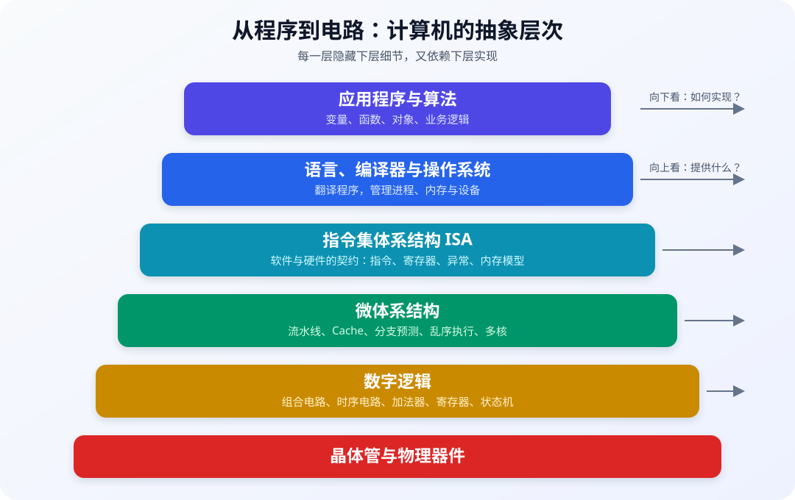
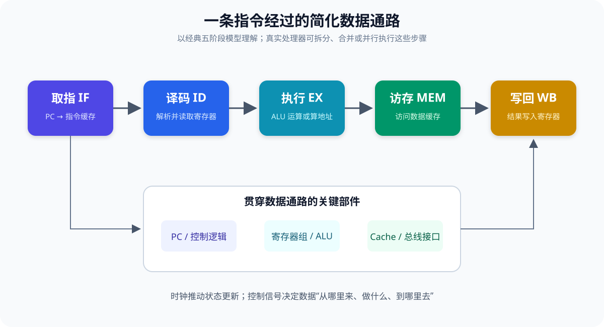
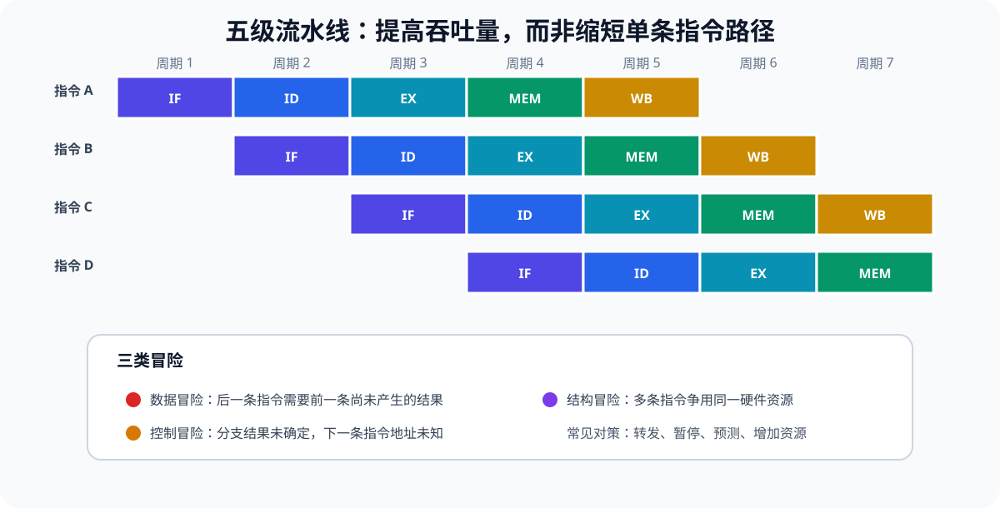
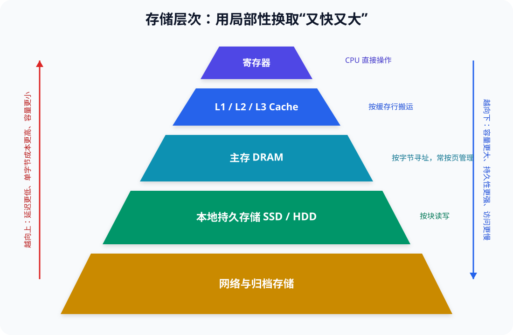
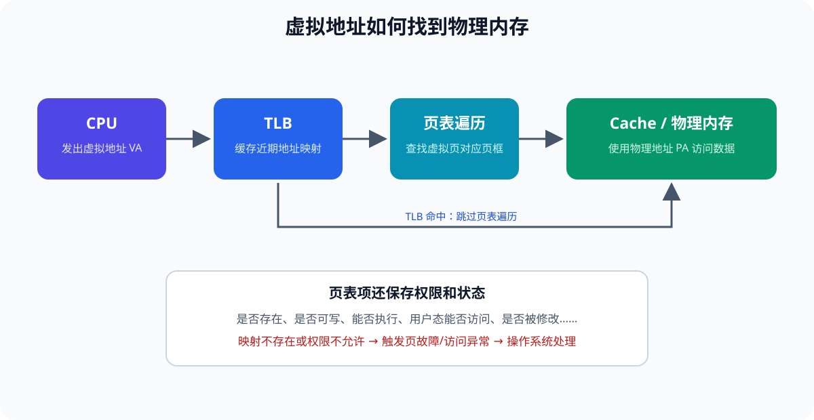

# 计算机组成原理

计算机组成原理研究的不是某一款 CPU 的使用方法，而是一个更根本的问题：

> 软件中的指令和数据，如何经过一层层硬件机制，最终变成晶体管状态的变化？

理解这门课以后，我们就能解释许多开发中的实际现象：

- 为什么顺序遍历数组通常比随机访问快？
- 为什么 `0.1 + 0.2` 可能不等于 `0.3`？
- 为什么一次内存访问可能比一次加法慢几十甚至几百倍？
- 为什么分支、锁和系统调用都有成本？
- 为什么多核并不意味着程序会自动加速？

本文以现代通用计算机为背景，同时使用简化模型建立直觉。文中的“五级流水线”“地址总线”等概念是便于学习的抽象；真实的 x86、ARM 和 RISC-V 处理器可能采用多发射、乱序执行、片上互连、非一致内存访问等更复杂的实现。

***

## 一、先建立全局视角：计算机是一组抽象层

计算机不是从高级语言一步直接跳到电路，而是由多个抽象层共同工作。



从上往下看：

1. **应用程序与算法** 描述“要解决什么问题”。
2. **语言、编译器和操作系统** 负责翻译程序并管理硬件资源。
3. **指令集体系结构（ISA）** 规定软件能看到怎样的处理器。
4. **微体系结构** 决定如何高效实现这套 ISA。
5. **数字逻辑** 用逻辑门、寄存器和状态机组成数据通路。
6. **晶体管与物理器件** 最终实现稳定的电信号状态。

这里最容易混淆的是 **ISA** 和 **微体系结构**：

| 概念          | 回答的问题          | 示例                  |
| ----------- | -------------- | ------------------- |
| 指令集体系结构 ISA | 处理器对软件承诺什么？    | 指令、寄存器、数据类型、异常、内存模型 |
| 微体系结构       | 处理器内部怎样实现这份承诺？ | 流水线、Cache、分支预测、乱序执行 |

同一套 ISA 可以有许多不同实现。例如，不同厂商、不同代际的 x86-64 CPU 都能运行同类程序，但内部流水线、缓存容量和执行单元并不相同。

计算机组成原理的核心主线可以概括为：

```text
信息编码
  ↓
逻辑电路
  ↓
数据通路与控制器
  ↓
指令集与程序执行
  ↓
存储层次
  ↓
输入输出与并行系统
```

***

## 二、信息为什么能用 0 和 1 表示

计算机选择二进制，根本原因不是数学上更高级，而是工程上更可靠。

晶体管可以被控制在两类稳定状态附近，例如“导通”和“截止”。电路再把一段电压范围解释成逻辑 `0`，另一段解释成逻辑 `1`。只要噪声没有越过判定边界，信息就不会改变。

因此，逻辑 `0/1` 是对连续物理世界的一层抽象，并不要求真实电压恰好等于 0 V 或某个固定值。

### 2.1 位、字节、字和字长

| 概念       | 含义                       |
| -------- | ------------------------ |
| bit（位）   | 最小二进制信息单位，只能取 0 或 1      |
| Byte（字节） | 通常由 8 bit 组成             |
| Word（字）  | 某种体系结构自然处理的一组位，含义依体系结构而定 |
| 字长       | 通常指通用寄存器和整数运算通路的典型宽度     |

“64 位 CPU”通常表示它具有 64 位通用寄存器和整数运算能力，但这**不意味着所有部件都是 64 位**，也不意味着它真的使用完整的 64 位物理地址。

必须区分：

- **数据宽度**：一次整数运算自然处理多少位。
- **虚拟地址宽度**：程序可表达多大的虚拟地址范围。
- **物理地址宽度**：处理器实际能连接多大的物理内存。
- **总线或通路宽度**：某条数据通路一次传输多少位。

它们可能不同。例如，一款 64 位处理器可能只实现部分虚拟地址位和更少的物理地址位。

### 2.2 位模式本身没有类型

同一串二进制：

```text
01000001
```

可以被解释为：

- 无符号整数 `65`；
- ASCII 字符 `'A'`；
- 某条机器指令的一部分；
- 图片中一个颜色通道的数值。

位模式的含义来自**解释它的规则和上下文**，而不是 0 和 1 自带的意义。

### 2.3 大端与小端

当一个多字节数据存入内存时，需要约定字节顺序。

以十六进制整数 `0x12345678` 从低地址开始存放为例：

```text
地址       A     A+1   A+2   A+3
大端序    12     34    56    78
小端序    78     56    34    12
```

- **大端序（Big-endian）**：最高有效字节放在低地址。
- **小端序（Little-endian）**：最低有效字节放在低地址。

端序只影响多字节数据在内存或通信协议中的排列，不会改变寄存器里这个数的数学值。x86 通常使用小端序；网络协议常规定使用大端字节序。

***

## 三、整数：有限位宽中的模运算

### 3.1 无符号整数

一个 (n) 位无符号整数的取值范围是：

```text
0 ～ 2^n - 1
```

8 位无符号整数范围是 `0 ～ 255`：

```text
00000000 = 0
00000001 = 1
11111111 = 255
```

当结果超出位宽时，高位会被丢弃。8 位无符号数的运算可以看作对 (2^8=256) 取模：

```text
11111111  (255)
+00000001  (1)
---------
00000000  (0，产生一个向外进位)
```

### 3.2 有符号整数与补码

现代计算机通常用**二进制补码**表示有符号整数。一个 (n) 位补码数的范围是：

```text
-2^(n-1) ～ 2^(n-1) - 1
```

8 位补码示例：

```text
00000000 =    0
00000001 =    1
01111111 =  127
10000000 = -128
11111110 =   -2
11111111 =   -1
```

一个正数变成对应负数，可以“按位取反再加 1”：

```text
  00000101  (+5)
→ 11111010  (按位取反)
+ 00000001
-----------
  11111011  (-5)
```

补码最重要的价值是：同一个二进制加法器可以统一处理有符号数和无符号数的加减运算。

```text
  00000101  (+5)
+ 11111011  (-5)
-----------
1 00000000
```

固定 8 位只保留低 8 位，结果就是 `0`。

### 3.3 进位不等于溢出

- \*\*进位（Carry）\*\*主要用于判断无符号运算是否超出范围。
- \*\*溢出（Overflow）\*\*主要用于判断有符号结果是否超出补码范围。

例如 8 位补码：

```text
  01111111  (+127)
+ 00000001  (+1)
-----------
  10000000  (-128)
```

这里没有得到正确的有符号结果，发生了有符号溢出。硬件通常把进位、溢出、结果为零、结果为负等信息写入状态标志，供后续条件跳转使用。

### 3.4 移位

- 逻辑左移：低位补 0，在不溢出时相当于乘 2。
- 逻辑右移：高位补 0，适合无符号数。
- 算术右移：高位复制符号位，常用于有符号数除以 2 的近似操作。

移位是否等价于乘除还受到溢出、符号和语言规则影响，不能脱离位宽直接套用。

***

## 四、浮点数：用有限位近似实数

整数的小数点位置固定，而浮点数通过指数改变小数点位置，因此能表示非常大或非常小的数。

IEEE 754 二进制浮点数通常由三部分组成：

```text
符号位 | 指数域 | 尾数域（更准确地说是有效数的小数部分）
```

规格化数的概念形式是：

```text
(-1)^符号 × 1.尾数 × 2^(指数-偏置)
```

常见格式：

| 格式         | 总位数 | 符号位 | 指数位 | 尾数位 |
| ---------- | --: | --: | --: | --: |
| 单精度 float  |  32 |   1 |   8 |  23 |
| 双精度 double |  64 |   1 |  11 |  52 |

### 4.1 为什么 `0.1 + 0.2` 不一定等于 `0.3`

十进制 `0.1` 转成二进制后是无限循环小数，只能舍入到有限位：

```text
0.1₁₀ = 0.0001100110011...₂
```

参与运算的实际值已经是近似值，再经过加法和舍入，结果可能与 `0.3` 的近似表示略有差异。

因此比较浮点数时通常使用允许误差：

```text
|a - b| < epsilon
```

金融金额等要求十进制精确语义的场景，通常使用十进制定点数或专用十进制类型，而不是直接使用二进制浮点数。

### 4.2 IEEE 754 的特殊值

- `+0` 和 `-0`
- `+∞` 和 `-∞`
- `NaN`：表示未定义或不可表示的结果，如 `0/0`
- 非规格化数：用于逐渐接近 0，避免最小规格化数与 0 之间突然断层

浮点数还涉及多种舍入模式。默认常见模式是“向最接近值舍入，正好居中时取偶数”。

***

## 五、字符、图片和指令也都是编码

### 5.1 字符编码

Unicode 为字符分配**码点**，UTF-8 则规定这些码点如何编码成字节序列。

例如：

```text
'A'       Unicode 码点 U+0041 → UTF-8: 41
'中'      Unicode 码点 U+4E2D → UTF-8: E4 B8 AD
```

所以“字符”“码点”“编码后的字节”是三个不同概念。字符串乱码通常不是数据凭空损坏，而是编码与解码规则不一致。

### 5.2 其他信息

- 图片：像素按某种颜色格式和压缩格式编码。
- 音频：声音经过采样、量化和编码。
- 指令：操作码、寄存器编号、立即数等被编码为机器字节。

对硬件而言，它们最终都只是位；区别来自使用者如何解释。

***

## 六、数字逻辑：怎样用电路完成计算

### 6.1 组合逻辑与时序逻辑

数字电路可以先分成两类：

| 类型   | 特点            | 例子            |
| ---- | ------------- | ------------- |
| 组合逻辑 | 输出只取决于当前输入    | 加法器、译码器、多路选择器 |
| 时序逻辑 | 输出还取决于过去保存的状态 | 寄存器、计数器、状态机   |

只有组合逻辑，计算机无法记住上一步发生了什么。寄存器等时序电路为系统引入“状态”，时钟则让大量状态单元在约定时刻更新。

### 6.2 基本逻辑门

| 逻辑门 | 布尔表达式   | 含义              |
| --- | ------- | --------------- |
| AND | `A ∧ B` | 两个输入都为 1 才输出 1  |
| OR  | `A ∨ B` | 至少一个输入为 1 就输出 1 |
| NOT | `¬A`    | 输入取反            |
| XOR | `A ⊕ B` | 两个输入不同时输出 1     |

理论上，仅使用 NAND 门或仅使用 NOR 门，也能构造所有布尔逻辑。

### 6.3 从半加器到全加器

半加器计算两个一位二进制数：

```text
Sum   = A XOR B
Carry = A AND B
```

多位加法还要接收低位进位 `Cin`，因此需要全加器：

```text
Sum  = A XOR B XOR Cin
Cout = (A AND B) OR (Cin AND (A XOR B))
```

把多个全加器连接起来，就能得到多位加法器。最简单的串行进位加法器会让进位逐级传播；更快的实现会通过超前进位等结构缩短等待时间。

### 6.4 多路选择器和控制信号

多路选择器（MUX）根据选择信号，从多个输入中选择一个输出。它是数据通路中的关键部件：

```text
控制信号 = 0 → 选择寄存器值
控制信号 = 1 → 选择立即数
```

控制器的核心任务，就是产生这些选择、读写、运算和更新信号，让数据在正确时间沿正确路径流动。

***

## 七、存储程序与计算机的基本组成

冯·诺依曼模型的核心思想是：

> 指令和数据都以二进制形式保存在可寻址存储器中，处理器按地址取出指令并执行。

经典模型包含五类功能部件：

| 部件   | 作用          |
| ---- | ----------- |
| 运算器  | 进行算术和逻辑运算   |
| 控制器  | 解释指令并产生控制信号 |
| 存储器  | 保存程序和数据     |
| 输入设备 | 把外部信息送入系统   |
| 输出设备 | 把处理结果送到外部   |

现代系统通常把运算器和控制器都集成在 CPU 内，并在芯片中加入寄存器、缓存、内存管理单元、分支预测器等部件。

### 7.1 冯·诺依曼结构和哈佛结构

- **冯·诺依曼结构**：指令和数据共享存储与通路。
- **哈佛结构**：指令和数据使用独立存储与通路。

现代通用 CPU 常呈现“改进的哈佛结构”：程序在统一地址空间中运行，但 L1 指令缓存和 L1 数据缓存分开，以便并行取指和读写数据。

### 7.2 瓶颈在哪里

处理器速度长期快于主存。CPU 即使拥有强大的执行单元，如果指令和数据不能及时送达，也只能等待。这种处理能力与数据供给能力之间的矛盾，通常称为“存储墙”，也是缓存和预取技术存在的重要原因。

***

## 八、CPU、寄存器与指令集

一个现代处理器核心通常包含：

```text
处理器核心
├── 前端：取指、分支预测、译码
├── 执行后端：整数、浮点、向量、访存单元
├── 寄存器与调度结构
├── L1 指令缓存 / L1 数据缓存
├── MMU / TLB
└── 提交、异常与控制逻辑
```

### 8.1 常见寄存器

| 寄存器      | 作用              |
| -------- | --------------- |
| PC / IP  | 保存下一条将要取出的指令地址  |
| 通用寄存器    | 保存操作数、地址和临时结果   |
| 状态寄存器    | 保存条件码、处理器模式等状态  |
| 栈指针 SP   | 指向当前栈顶          |
| 向量/浮点寄存器 | 保存浮点数或一组并行处理的数据 |

教材中的 MAR（存储器地址寄存器）、MDR（存储器数据寄存器）、IR（指令寄存器）适合描述数据通路功能，但真实 CPU 未必把它们实现为软件可见、名称固定的独立寄存器。

### 8.2 ISA 是软硬件契约

指令集体系结构通常规定：

- 有哪些机器指令；
- 有哪些软件可见寄存器；
- 支持哪些数据类型和寻址方式；
- 指令如何编码；
- 异常、中断和特权级如何工作；
- 原子操作和内存顺序遵循什么规则。

常见 ISA：

| ISA    | 特点                         |
| ------ | -------------------------- |
| x86-64 | 兼容历史包袱较重，指令长度可变，桌面与服务器广泛使用 |
| ARM    | 重视能效，广泛用于移动设备，也进入桌面和服务器    |
| RISC-V | 开放、模块化，便于教学、研究和定制          |

### 8.3 RISC 与 CISC 不宜简单二分

传统上：

- RISC 强调简单、规整、常见定长指令和 Load/Store 结构。
- CISC 允许更复杂的指令和寻址方式。

但现代高性能处理器会在内部把复杂指令转换成更小的微操作，也会使用深流水、乱序执行和复杂预测。因此，不能仅凭“指令简单还是复杂”判断实际性能。

### 8.4 一条指令由什么组成

概念上，一条指令包含：

```text
操作码 + 操作数描述
```

例如伪汇编：

```asm
ADD R1, R2, R3    ; R1 = R2 + R3
LOAD R4, [R5+8]   ; 从地址 R5+8 读取数据到 R4
BEQ R1, R0, label ; 如果 R1 == 0，则跳转
```

操作数可能来自：

- 寄存器；
- 指令中的立即数；
- 内存；
- 某些指令隐含指定的位置。

***

## 九、一条指令是怎样执行的

经典教学模型把指令执行分成五个阶段：



### 9.1 取指 IF

PC 给出下一条指令的虚拟地址。处理器经过地址转换并查询指令缓存，取得指令字节，然后计算顺序执行时的下一个 PC。

如果遇到分支，预测器会提前猜测下一条指令地址，避免前端停顿。

### 9.2 译码 ID

译码器识别：

- 要执行什么操作；
- 需要哪些源操作数；
- 结果写到哪里；
- 是否访问内存；
- 是否改变控制流。

复杂处理器可能把一条机器指令拆成多个内部微操作。

### 9.3 执行 EX

执行单元完成工作：

- ALU 做整数运算或逻辑运算；
- 浮点/向量单元处理浮点数和 SIMD 数据；
- 地址生成单元计算有效地址；
- 分支单元判断分支方向和目标。

### 9.4 访存 MEM

Load/Store 指令访问数据缓存。缓存未命中时，请求会继续到更低层缓存乃至主存。

并非所有指令都需要访问数据内存。例如寄存器加法通常在执行后即可产生结果。

### 9.5 写回和提交

简单模型把结果写回寄存器称为 WB。乱序处理器还要区分：

- **完成**：某条指令的计算结果已经产生；
- **提交/退休**：确认该指令按程序顺序生效，不会被更早的异常或错误预测取消。

按顺序提交使处理器能够提供**精确异常**：发生异常时，之前的指令已经生效，之后的指令看起来尚未执行。

### 9.6 控制器怎样实现

控制器常见两种思路：

- **硬布线控制**：由组合逻辑直接生成控制信号，通常速度快。
- **微程序控制**：把复杂指令分解为一系列微指令，设计更灵活。

现代处理器经常混合使用多种方法，不能把某一款处理器简单归为纯粹的一类。

***

## 十、高级语言如何变成机器指令

以 C/C++ 的常见提前编译流程为例：

```text
源代码
  ↓ 预处理
处理头文件、宏和条件编译
  ↓ 编译
语义分析、优化并生成汇编或中间结果
  ↓ 汇编
生成目标文件
  ↓ 链接
合并目标文件和库，解析符号与重定位
  ↓ 加载
操作系统建立进程地址空间并映射程序
  ↓ 执行
CPU 从入口地址开始取指
```

解释型语言和虚拟机语言的路径有所不同：

- 解释器读取源码或字节码并执行对应逻辑；
- JIT 编译器在运行时把热点代码编译成机器码；
- 最终真正驱动硬件工作的仍然是机器指令。

### 10.1 一个加法函数的底层轮廓

```c
int add(int a, int b) {
    return a + b;
}
```

概念上可能变成：

```asm
ADD return_register, arg_register_1, arg_register_2
RET
```

实际使用哪些寄存器、参数如何传递、谁保存寄存器，由\*\*应用二进制接口（ABI）\*\*和调用约定决定。

### 10.2 函数调用与栈

函数调用通常涉及：

1. 把参数放入约定的寄存器或栈位置；
2. 保存返回地址；
3. 跳转到函数入口；
4. 为局部变量建立栈帧（若需要）；
5. 执行函数；
6. 恢复现场并返回。

并非每次调用都一定把返回地址“压栈”。某些 ISA 使用链接寄存器；编译器还可能内联函数，从而完全消除调用。

***

## 十一、性能的基本公式

讨论 CPU 性能时，不能只看主频。

一个常用近似式是：

```text
CPU 执行时间 = 指令数 × CPI × 时钟周期
             = 指令数 × CPI / 时钟频率
```

其中：

- **指令数**受算法、编译器和 ISA 影响；
- **CPI**表示平均每条指令消耗多少时钟周期；
- **时钟频率**表示每秒有多少个时钟周期。

提高主频可能缩短时钟周期，但缓存未命中、分支预测失败、数据依赖等都会抬高 CPI。不同 ISA 的“指令数”含义也不同，因此不能仅按主频或单一指标比较处理器。

### 11.1 延迟与吞吐量

- **延迟（Latency）**：完成一个任务要多久。
- **吞吐量（Throughput）**：单位时间能完成多少任务。

流水线往往主要提升吞吐量；多核可以提升可并行任务的总吞吐量；二者未必显著缩短单个任务的延迟。

### 11.2 Amdahl 定律

如果程序中比例为 (P) 的部分可被加速 (S) 倍，总加速比为：

```text
Speedup = 1 / ((1 - P) + P / S)
```

即使把 90% 的部分无限加速，剩余 10% 仍会把总加速比限制在 10 倍。这说明优化应关注真正占用总时间的部分。

***

## 十二、流水线、预测与乱序执行

### 12.1 流水线

流水线让多条指令的不同阶段重叠执行：



理想状态下，流水线填满后可以每个周期完成一条或多条指令。但现实中存在三类冒险：

| 冒险   | 原因           | 常见处理         |
| ---- | ------------ | ------------ |
| 数据冒险 | 后一条指令依赖前一条结果 | 转发、暂停、乱序调度   |
| 控制冒险 | 分支方向或目标尚未确定  | 分支预测、推测执行    |
| 结构冒险 | 多条指令争用同一硬件   | 增加端口或执行资源、暂停 |

### 12.2 分支预测与推测执行

处理器在分支结果尚未算出时预测下一条 PC，并沿预测路径继续取指和执行。

- 预测正确：隐藏等待时间。
- 预测错误：取消错误路径上的结果，恢复正确状态，流水线损失若干周期。

推测执行的结果在提交前不能成为体系结构可见状态，但它可能改变缓存等微体系结构状态。这也是 Spectre 一类侧信道漏洞产生的基础之一。

### 12.3 乱序执行

假设有三条指令：

```text
A：从内存读取数据（很慢）
B：依赖 A
C：与 A、B 都无关
```

顺序等待会让 C 也停住。乱序处理器可以先执行已经具备操作数的 C，再等待 A 和 B，同时最终仍按程序顺序提交结果。

关键技术通常包括：

- 寄存器重命名：消除由寄存器名字复用造成的假依赖；
- 动态调度：选择操作数已经就绪的微操作；
- 重排序缓冲区：支持按顺序提交和精确异常；
- 多发射：一个周期向多个执行单元发送多条操作。

“乱序执行”不等于程序语义乱了。处理器必须遵守 ISA 定义的可观察行为和内存模型。

### 12.4 SIMD 与向量计算

SIMD 让一条指令对一组数据执行相同操作：

```text
[a0, a1, a2, a3] + [b0, b1, b2, b3]
```

它适合图像、音视频、科学计算、机器学习等数据并行任务。现代编译器可能自动向量化循环，程序也可以使用专用向量指令。

***

## 十三、存储层次：为什么不能只用一种存储器

理想存储器应同时满足：

- 延迟低；
- 带宽高；
- 容量大；
- 成本低；
- 断电不丢失。

现实中这些目标相互制约，因此系统使用分层结构。



具体延迟会随硬件平台变化，但数量级关系很稳定：

```text
寄存器 < L1 Cache < L2 Cache < L3 Cache < DRAM < SSD < 网络/磁盘
```

### 13.1 局部性原理

缓存有效的基础是程序通常具有局部性：

- **时间局部性**：刚访问的数据近期可能再次访问。
- **空间局部性**：访问某地址后，附近地址可能很快被访问。

例如顺序遍历数组：

```c
for (int i = 0; i < n; ++i) {
    sum += array[i];
}
```

硬件不会只从内存取一个整数，而通常以一整个**缓存行**为单位搬运相邻数据，因此后续元素很可能已经在缓存中。

### 13.2 Cache 的基本结构

主存地址通常被拆成：

```text
标记 Tag | 组索引 Index | 块内偏移 Offset
```

访问流程：

1. 用组索引定位 Cache 中的一组；
2. 比较标记，判断目标缓存行是否存在；
3. 命中则按块内偏移取出数据；
4. 未命中则向下一级请求整条缓存行。

按一个内存块可以放到多少个位置，Cache 分为：

| 映射方式 | 特点                  |
| ---- | ------------------- |
| 直接映射 | 每个块只有一个位置，简单快速但易冲突  |
| 全相联  | 可放任意位置，冲突少但查找成本高    |
| 组相联  | 每个块可放在某组的若干位置，是常见折中 |

### 13.3 写策略

- **写直达（Write-through）**：更新 Cache 时也立即更新下一级。
- **写回（Write-back）**：先只改 Cache，替换脏缓存行时再写回。
- **写分配**：写未命中时先把缓存行读入 Cache。
- **非写分配**：写未命中时绕过本级 Cache。

现代 CPU 数据缓存常使用写回策略，但具体设计依处理器而异。

### 13.4 平均内存访问时间

简化公式：

```text
AMAT = 命中时间 + 未命中率 × 未命中代价
```

即使未命中率很低，只要访问主存的代价很大，仍可能显著拖慢程序。

### 13.5 实际编程中的缓存问题

- 顺序访问通常优于大跨度随机访问；
- 紧凑数据结构通常优于大量指针跳转；
- 对二维数组，应尽量按其内存布局连续访问；
- 多线程修改同一缓存行上的不同变量，可能产生**伪共享**；
- 软件预取和复杂分块只有在测量证明有效时才值得引入。

***

## 十四、主存、DRAM 与持久存储

### 14.1 DRAM 为什么需要刷新

主存通常使用 DRAM。每个存储单元依靠电容保存电荷，而电荷会泄漏，因此控制器需要周期性刷新。

DRAM 访问具有行、列和存储体等组织结构。访问同一已打开行通常比切换到另一行更快，因此内存访问模式也会影响实际延迟和带宽。

### 14.2 内存控制器与通道

内存控制器负责：

- 把处理器请求转换成 DRAM 命令；
- 调度读写和刷新；
- 在多个通道、存储体之间安排请求；
- 某些平台还负责错误检测与纠正。

多通道内存主要增加带宽，不等于单次访问延迟按通道数成比例下降。

### 14.3 ECC

ECC 内存保存额外校验信息，可检测并纠正某些位错误。它常用于服务器和对可靠性要求高的系统，但 ECC 不能替代备份，也不能解决所有硬件故障。

### 14.4 SSD 与 HDD

| 特性    | SSD            | HDD        |
| ----- | -------------- | ---------- |
| 介质    | 闪存             | 磁性盘片       |
| 随机访问  | 较快             | 受机械寻道影响较大  |
| 擦写特性  | 写前通常需擦除，存在寿命管理 | 可直接覆盖扇区    |
| 控制器工作 | 映射、垃圾回收、磨损均衡   | 缓存、寻道和扇区管理 |

CPU 通常不能像访问普通内存一样直接执行 SSD 中的程序。操作系统先把程序文件映射或读取到内存页，CPU 再从内存层次中取指。

***

## 十五、虚拟内存：程序看到的地址不等于物理地址

每个进程通常使用独立的虚拟地址空间。虚拟内存提供：

- 地址隔离和访问保护；
- 让程序拥有连续、统一的地址视图；
- 灵活映射文件、共享库和共享内存；
- 按需分配物理页；
- 在必要时把部分页面换出到持久存储。



### 15.1 地址转换

虚拟地址可概念性地拆成：

```text
虚拟页号 VPN | 页内偏移
```

页表把虚拟页号映射到物理页框号：

```text
物理页框号 PPN | 原来的页内偏移
```

页内偏移不变，因为一页内部的相对位置没有改变。

### 15.2 TLB

每次访存若都在内存中遍历多级页表，成本会很高。TLB 是地址转换结果的高速缓存：

- TLB 命中：快速得到物理页框号；
- TLB 未命中：由硬件或软件执行页表遍历；
- 页表项无有效映射或违反权限：触发异常，由操作系统处理。

TLB 未命中不一定等于缺页。前者可能只是转换缓存中没有记录，后者表示页表项无法直接满足这次访问。

### 15.3 页故障不一定是错误

页故障可能表示：

- 首次访问按需分配的页面；
- 文件映射页面尚未读入；
- 页面被换出，需要重新载入；
- 写入写时复制页面，需要创建私有副本；
- 访问非法地址或违反权限。

前几类是正常的内存管理机制，最后一类才通常导致进程收到错误信号或异常。

***

## 十六、总线、互连与输入输出

教材常把总线分为：

| 类型   | 作用              |
| ---- | --------------- |
| 地址总线 | 指明访问位置          |
| 数据总线 | 传输数据            |
| 控制总线 | 传输读写、时钟、仲裁等控制信息 |

这个模型有助于理解基本通信。现代系统中，处理器核心、缓存、内存控制器和设备之间常使用分层、点对点或片上网络式互连，并通过事务和数据包传递请求，不一定存在一组所有部件共享的物理导线。

### 16.1 设备控制器与内存映射 I/O

CPU 通常不直接操纵设备内部机械或电气细节，而是访问设备控制器暴露的寄存器。

许多体系结构使用**内存映射 I/O（MMIO）**：把设备寄存器映射到地址空间，CPU 用类似 Load/Store 的方式读取状态或写入命令。

这些地址对应的是设备行为，不是普通 RAM，因此访问顺序和缓存策略需要遵守专门规则。

### 16.2 三种 I/O 方式

**程序查询**

CPU 反复读取设备状态，直到设备完成。实现简单，但忙等会浪费处理器时间。

**中断**

CPU 发出请求后执行其他任务，设备完成时发送中断。处理器保存必要现场，转入中断处理程序，完成后恢复执行。

**DMA**

对大块数据，CPU 只负责设置源地址、目标地址、长度和方向，DMA 引擎直接在设备与内存之间传输，结束后再中断通知 CPU。

```text
CPU 配置 DMA
  ↓
设备控制器 ↔ 内存
  ↓
传输完成，中断 CPU
```

DMA 减少了 CPU 搬运数据的工作，但仍涉及缓冲区管理、缓存一致性、地址映射和完成通知。

### 16.3 中断、异常与系统调用

三者都会改变控制流，但来源不同：

| 机制   | 来源             | 例子         |
| ---- | -------------- | ---------- |
| 中断   | 通常来自外部设备，具有异步性 | 网卡收包、定时器到期 |
| 异常   | 当前指令执行引起，通常同步  | 除零、缺页、非法指令 |
| 系统调用 | 程序主动执行特定指令     | 请求读文件、创建进程 |

处理器通过特权级和受控入口进入内核，避免普通程序任意操作设备或修改关键系统状态。

***

## 十七、多核、缓存一致性与内存模型

### 17.1 并发和并行

- **并发**：多个任务在一段时间内交替推进。
- **并行**：多个任务在同一时刻由不同执行资源处理。

单核可以通过任务切换实现并发；多核能够真正并行执行多个指令流。

### 17.2 为什么 `count++` 不是原子操作

它通常包含：

```text
读取 count
加 1
写回 count
```

两个核心可能同时读到旧值，再分别写回相同的新值，导致一次更新丢失。解决这类问题需要锁、原子读改写指令或其他同步机制。

### 17.3 缓存一致性

每个核心拥有私有缓存时，同一物理地址可能存在多个副本。缓存一致性协议负责让各核心最终对单个缓存行的写入形成一致认识。

常见协议会让缓存行在“已修改、独占、共享、无效”等状态之间转换。一个核心写共享行前，通常要让其他核心的副本失效或取得该行所有权。

缓存一致性解决的是**同一地址的缓存副本问题**，但它不自动保证多地址操作按照程序员直觉的顺序被其他核心观察。

### 17.4 内存一致性模型和内存屏障

编译器和处理器都可能在不破坏单线程语义的前提下重排操作。多线程程序必须使用语言提供的：

- 互斥锁；
- 原子变量；
- 内存序；
- 条件变量、信号量等同步原语。

内存屏障约束特定读写的可见顺序。普通业务代码应优先使用语言和标准库的高级同步机制，而不是直接拼装平台相关屏障。

### 17.5 伪共享

两个线程虽然修改不同变量，但变量恰好位于同一缓存行。缓存一致性以缓存行为单位转移所有权，导致缓存行在核心之间频繁来回移动，这就是伪共享。

可通过调整数据布局、分片或适当填充减少伪共享，但应先用性能工具确认。

### 17.6 NUMA

多路服务器中，内存可能物理上靠近不同处理器节点：

- 访问本地节点内存较快；
- 访问远端节点内存需要经过互连，延迟更高、共享带宽更有限。

这种结构称为非一致内存访问（NUMA）。线程调度和内存分配位置会影响大型服务的性能。

***

## 十八、从一段程序到屏幕输出的完整链路

以这段 C 代码为例：

```c
int a = 1;
int b = 2;
printf("%d\n", a + b);
```

一次可能的完整链路是：

```text
源代码
  ↓ 编译、汇编、链接
可执行文件保存在 SSD
  ↓ 操作系统创建进程并建立虚拟地址空间
代码页、数据页和共享库按需映射
  ↓ CPU 通过虚拟地址取指
TLB 完成地址转换，指令 Cache 提供指令
  ↓ 指令被译码和调度
ALU 计算 1 + 2
  ↓ 调用 printf
运行库把整数格式化成字符字节
  ↓ 执行 write 系统调用
处理器切换到内核态
  ↓ 内核把数据交给终端或文件子系统
设备驱动配置控制器或 DMA
  ↓ 设备工作完成并可能发出中断
最终在终端显示 3
```

这条链路同时涉及编译器、ISA、流水线、Cache、虚拟内存、操作系统、驱动和 I/O 设备。计算机组成原理重点解释其中硬件提供了什么能力，以及各部件怎样协同。

***

## 十九、常见误区

### 19.1 “64 位 CPU 可以直接使用 2^64 字节内存”

不准确。64 位通常指通用数据通路和寄存器宽度；实际虚拟地址位数和物理地址位数由具体处理器与平台决定。

### 19.2 “CPU 每次都直接从内存取指令”

概念上指令来自存储系统，实际上通常先查 TLB 和多级指令缓存，只有未命中时才逐级访问更低层。

### 19.3 “一条指令执行完，下一条才开始”

简单处理器可能接近这种方式，高性能处理器通常使用流水线、多发射、推测和乱序执行，让许多指令同时处于不同阶段。

### 19.4 “Cache 命中就不需要地址转换”

地址转换与 Cache 查询的先后关系取决于 Cache 设计。有些步骤可并行，但程序发出的虚拟地址仍必须按体系结构规则映射和检查权限。

### 19.5 “多核会让任何程序按核心数加速”

程序必须有足够的可并行部分，还要付出同步、通信、调度和缓存一致性成本。串行部分会按 Amdahl 定律限制总加速比。

### 19.6 “有缓存一致性就不需要锁”

缓存一致性不等于操作原子性，也不等于跨地址的内存顺序。数据竞争仍需通过正确的同步原语解决。

### 19.7 “主频越高，CPU 一定越快”

性能还受每周期完成的工作量、缓存、分支预测、执行单元、内存带宽、功耗限制和工作负载类型影响。

***

## 二十、如何分析一个程序为什么慢

先测量，再定位，不要仅凭直觉优化。

可以沿以下层次提问：

1. **算法**：时间复杂度和数据规模是否合理？
2. **指令**：编译器是否生成了多余指令，是否完成向量化？
3. **前端**：是否频繁发生指令缓存未命中或分支预测失败？
4. **执行**：是否受数据依赖、除法等高延迟操作限制？
5. **缓存**：数据访问是否局部，是否有大量缓存未命中？
6. **内存**：受延迟还是带宽限制，是否存在 NUMA 远端访问？
7. **并发**：是否存在锁竞争、伪共享和过多线程切换？
8. **I/O**：是否在等待磁盘、网络或设备？
9. **系统**：是否有缺页、内存压力、中断或功耗降频？

常用观测指标包括：

- 运行时间和吞吐量；
- IPC（每周期退休指令数）或 CPI；
- 各级 Cache 和 TLB 未命中；
- 分支预测失败；
- CPU 利用率、上下文切换和缺页；
- 内存带宽与 I/O 延迟。

具体工具依平台而异，例如 Linux 的 `perf`、Windows Performance Analyzer、处理器厂商性能分析器和语言运行时分析器。

***

## 二十一、核心术语速查

| 中文        | 英文                     | 核心含义                 |
| --------- | ---------------------- | -------------------- |
| 指令集体系结构   | ISA                    | 软件可见的处理器接口与行为规范      |
| 微体系结构     | Microarchitecture      | ISA 的具体内部实现          |
| 算术逻辑单元    | ALU                    | 执行整数算术和逻辑运算          |
| 程序计数器     | PC / IP                | 指向下一条待取指令            |
| 应用二进制接口   | ABI                    | 调用约定、数据布局、目标文件等二进制规则 |
| 每指令周期数    | CPI                    | 平均每条指令消耗的周期数         |
| 每周期指令数    | IPC                    | 平均每周期退休的指令数          |
| 流水线       | Pipeline               | 重叠多条指令的不同处理阶段        |
| 分支预测      | Branch Prediction      | 提前猜测控制流方向和目标         |
| 乱序执行      | Out-of-order Execution | 先执行已经就绪的指令，按序提交      |
| 缓存行       | Cache Line             | Cache 与下一级交换数据的基本单位  |
| 局部性       | Locality               | 程序倾向于重访近期或相邻数据       |
| 地址转换后备缓冲器 | TLB                    | 缓存虚拟页到物理页的映射         |
| 内存管理单元    | MMU                    | 执行地址转换和权限检查          |
| 直接内存访问    | DMA                    | 设备与内存之间直接批量传输数据      |
| 内存映射 I/O  | MMIO                   | 通过地址空间访问设备寄存器        |
| 缓存一致性     | Cache Coherence        | 协调多个缓存中的同一内存块副本      |
| 内存模型      | Memory Model           | 定义多线程可观察的内存操作顺序      |
| 非一致内存访问   | NUMA                   | 内存访问代价随处理器节点而不同      |

***

## 二十二、学习路线与总结

推荐按下面的顺序学习：

```text
二进制与数据表示
  ↓
布尔代数、组合逻辑、时序逻辑
  ↓
寄存器、ALU、数据通路和控制器
  ↓
指令集、汇编和函数调用
  ↓
流水线、预测、乱序与性能公式
  ↓
Cache、DRAM 和虚拟内存
  ↓
总线、异常、中断与 DMA
  ↓
多核、缓存一致性和内存模型
```

学习时始终追问四个问题：

1. **信息在哪里？** 是在寄存器、Cache、内存还是设备中？
2. **数据怎样流动？** 由哪条通路、哪种协议搬运？
3. **谁发出控制？** 是当前指令、控制器、操作系统还是设备？
4. **性能损失在哪里？** 是依赖、预测失败、缓存未命中还是 I/O 等待？

最后把整门课压缩成一句话：

> 计算机组成原理研究的是：硬件如何编码信息、保存状态、执行指令，并通过存储层次、输入输出和并行机制，以正确且高效的方式运行程序。

当这条主线建立起来后，操作系统、编译原理、数据库、计算机网络和高性能编程中的许多现象，就不再是孤立的规则，而会成为同一套软硬件协作机制的自然结果。
