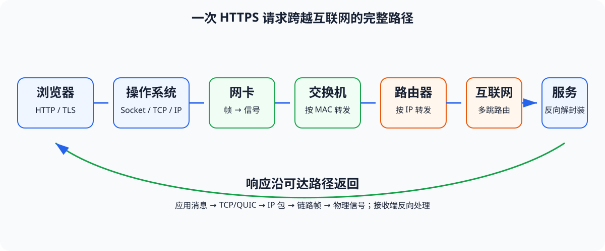
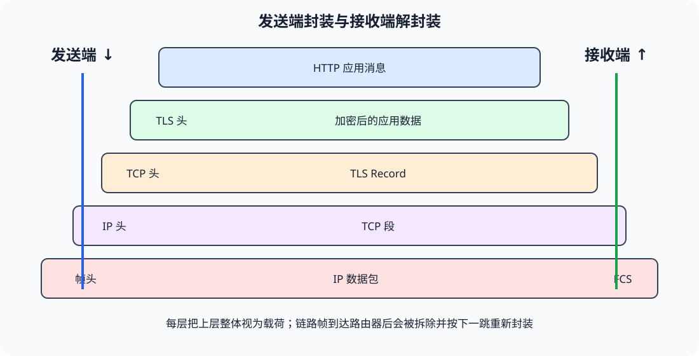
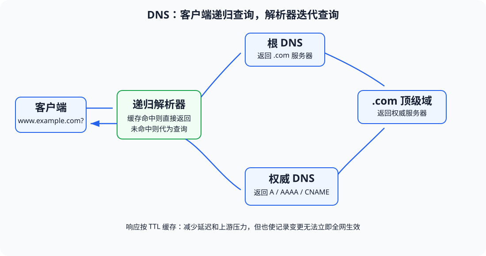
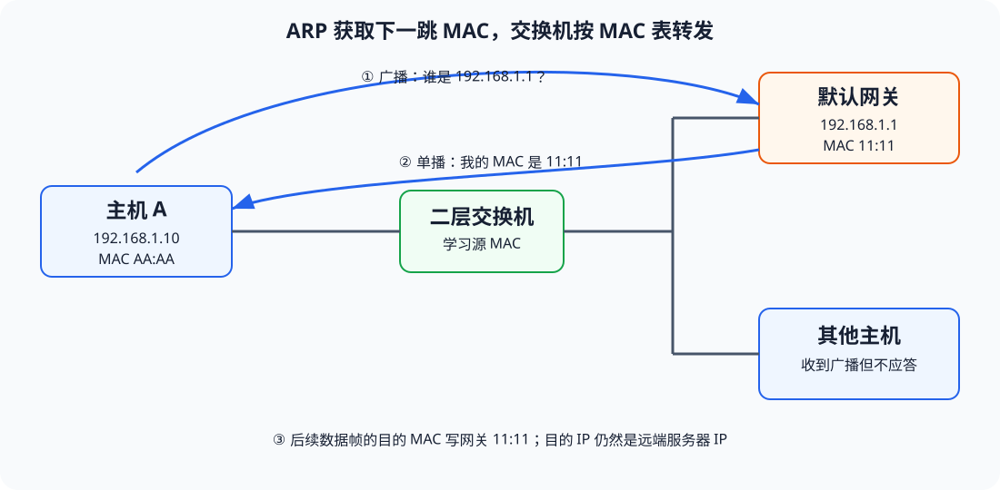
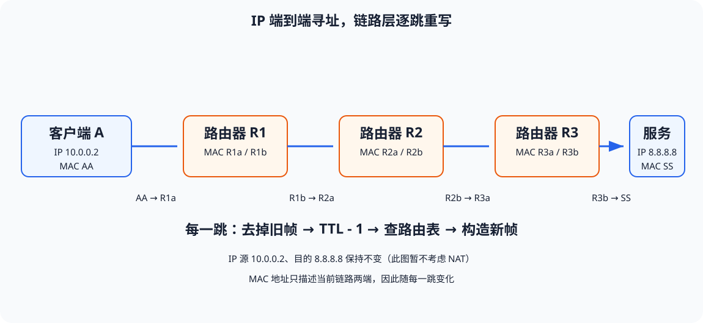
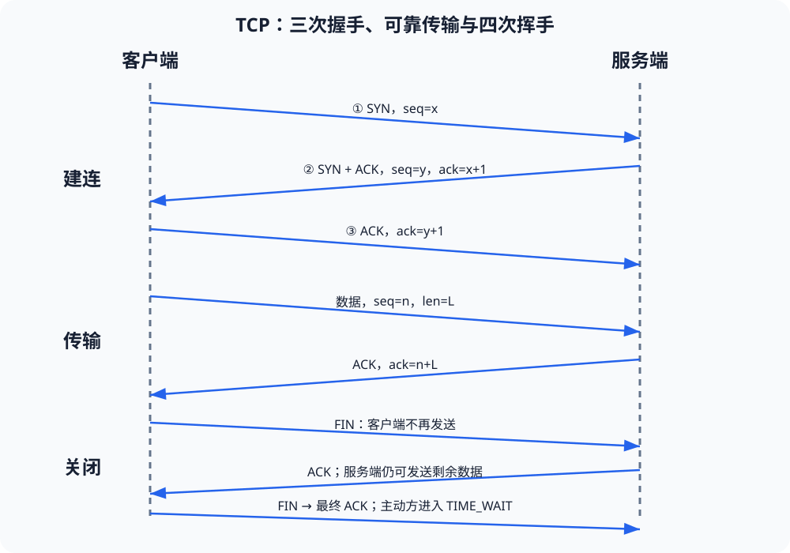
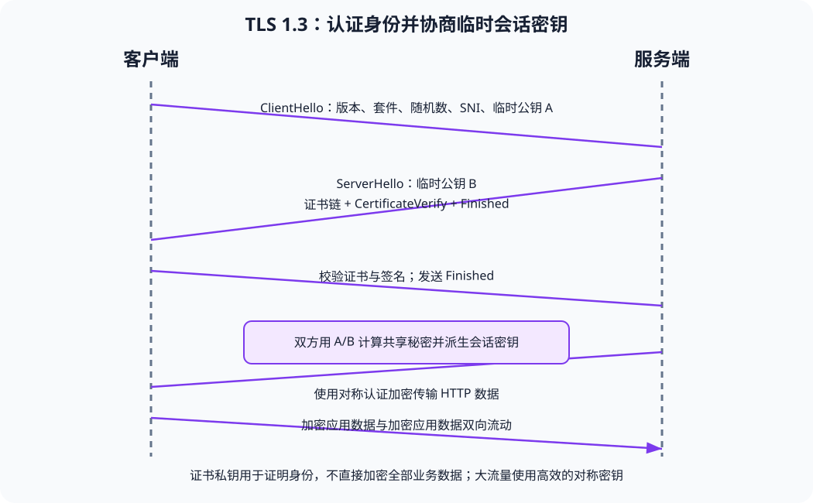
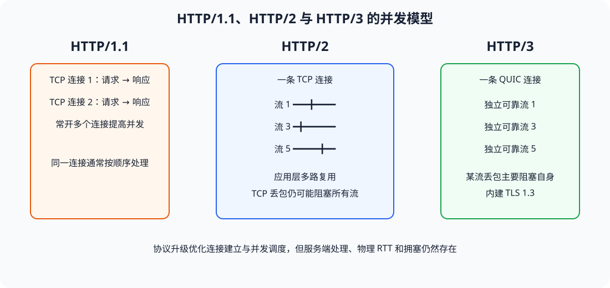
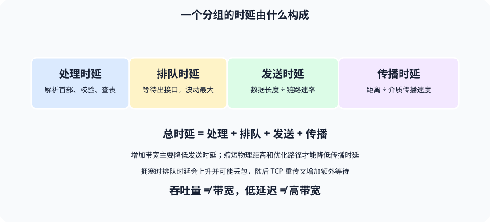

# 计算机网络工作原理：从输入 URL 到数据跨越互联网

> 本文不把计算机网络理解为一组孤立协议，而是追踪一份数据如何从应用程序出发，经操作系统、网卡、交换机、路由器和服务器，再沿原路返回。读完后应能回答：每一层解决什么问题、数据经过设备时发生了什么、为什么需要这些协议，以及网络故障应该从哪里查起。

## 一、先建立全局视角

计算机网络解决的本质问题是：**让不同主机中的进程，在不可靠且结构复杂的物理网络上完成可识别、可寻址、可转发、可校验的通信。**

一次访问 `https://www.example.com/index.html`，至少涉及以下组件：

1. 浏览器解析 URL，确定协议、主机名、端口和资源路径。
2. 操作系统通过 DNS 把域名解析为 IP 地址。
3. 浏览器创建 Socket，操作系统选择源端口、源 IP 和路由。
4. 若目标不在本地网段，主机通过 ARP 或 NDP 找到默认网关的链路层地址。
5. TCP 建立连接；若使用 HTTPS，TLS 再完成身份认证和密钥协商。
6. HTTP 请求被逐层封装为 TLS 记录、TCP 段、IP 包、以太网帧和物理信号。
7. 交换机按 MAC 地址转发帧，路由器按 IP 路由表逐跳转发数据包。
8. 服务器逐层解封装，把请求交给监听目标端口的进程。
9. 响应经过相反过程返回，浏览器解析 HTML，并继续请求 CSS、JavaScript、字体和图片。



### 1.1 网络中的四类关键标识

| 标识     | 解决的问题         | 作用范围            | 示例                  |
| ------ | ------------- | --------------- | ------------------- |
| 域名     | 人如何记住服务       | 应用层、全球 DNS 命名空间 | `www.example.com`   |
| IP 地址  | 数据包最终送到哪台网络接口 | 跨网络、端到端寻址       | `93.184.216.34`     |
| MAC 地址 | 当前链路上的帧交给谁    | 单个二层广播域         | `00:1A:2B:3C:4D:5E` |
| 端口     | 主机收到数据后交给哪个进程 | 单台主机的传输层        | HTTPS 默认 `443`      |

必须特别注意：

- 域名不是数据包转发地址。DNS 完成后，网络主要使用 IP 地址。
- MAC 地址不是互联网范围的地址。它通常只在当前局域网或当前链路有效。
- IP 地址定位主机或网络接口，端口定位主机内的应用进程。
- 一个 TCP 连接通常由五元组唯一标识：`源 IP、源端口、目的 IP、目的端口、传输层协议`。

### 1.2 分层不是概念游戏，而是工程解耦

| TCP/IP 层 | 典型协议               | 数据单元   | 核心职责             | 常见设备或实现           |
| -------- | ------------------ | ------ | ---------------- | ----------------- |
| 应用层      | HTTP、DNS、SSH、SMTP  | 消息     | 定义业务数据格式与交互语义    | 浏览器、Web 服务、DNS 服务 |
| 传输层      | TCP、UDP、QUIC       | 段、数据报  | 进程到进程通信、可靠性、拥塞控制 | 操作系统协议栈、用户态 QUIC  |
| 网际层      | IPv4、IPv6、ICMP     | IP 数据包 | 跨网络寻址和逐跳路由       | 主机、三层交换机、路由器      |
| 链路层      | Ethernet、Wi-Fi、PPP | 帧      | 在相邻节点间交付数据       | 网卡、交换机、无线 AP      |
| 物理层      | 双绞线、光纤、无线电         | 比特、符号  | 把比特转换为可传播的信号     | PHY 芯片、光模块、天线     |

分层的价值在于：浏览器不必知道光纤怎样发光，路由器不必理解 HTTP 内容，交换机不必理解浏览器正在访问哪个页面。每层只依赖下层提供的服务，并向上层提供稳定接口。

## 二、数据是如何逐层封装的

假设浏览器要发送一段 HTTP 请求：

```http
GET /index.html HTTP/1.1
Host: www.example.com
```

发送端的处理过程如下：

1. 应用层生成 HTTP 消息。
2. TLS 将明文加密并封装为 TLS Record。
3. TCP 添加源端口、目的端口、序号、确认号和标志位。
4. IP 添加源 IP、目的 IP、TTL 和上层协议号。
5. 以太网添加源 MAC、下一跳 MAC、EtherType，并在尾部添加 FCS。
6. 网卡将帧编码成电信号、光信号或无线电波。

接收端按相反顺序检查并去掉首部，称为**解封装**。



### 2.1 哪些字段端到端不变，哪些逐跳变化

在没有 NAT、代理和隧道的理想路径中：

- HTTP 语义端到端保持不变。
- TCP 的源/目的端口端到端保持不变。
- IP 的源/目的地址端到端保持不变，但 TTL 每经过一台路由器减一，IPv4 首部校验和随之更新。
- 以太网源/目的 MAC **每经过一个三层路由节点都会重写**。
- 物理信号只存在于一段介质中，每一跳都会被接收并重新编码发送。

因此，“把服务器 MAC 地址写进帧就能跨越互联网”是错误理解。客户端只需要知道当前下一跳的 MAC 地址；远端链路如何交付，由后续路由器分别处理。

### 2.2 MTU、MSS 与分片

- **MTU**：链路层一次能承载的最大网络层数据包大小。以太网常见 MTU 为 `1500` 字节。
- **MSS**：TCP 单个段可承载的最大应用数据量，通常为 `MTU - IP 首部 - TCP 首部`。IPv4 无选项时常见值为 `1460`。
- IPv4 允许路由器分片，但分片丢失会导致整个原始数据报无法重组。
- IPv6 路由器不进行分片，只允许源主机依据路径 MTU 选择大小。
- Path MTU Discovery 依赖 ICMP。错误屏蔽 ICMP 可能造成“小包正常、大包卡住”的黑洞问题。

## 三、接入网络：主机如何获得通信参数

设备连接家庭或企业网络后，通常需要获得：

- 本机 IP 地址和子网前缀；
- 默认网关；
- DNS 服务器；
- 地址租期及其他网络参数。

### 3.1 DHCP 的 DORA 流程

IPv4 主机常通过 DHCP 完成自动配置：

1. **Discover**：客户端还没有 IP，以广播方式寻找 DHCP 服务器。
2. **Offer**：服务器提供一个可用地址及网络配置。
3. **Request**：客户端广播声明选择了哪个地址和服务器。
4. **ACK**：服务器确认租约，客户端正式使用地址。

客户端最初可使用源地址 `0.0.0.0`、目的地址 `255.255.255.255`，UDP 端口通常为客户端 `68`、服务器 `67`。跨网段部署时，路由器上的 DHCP Relay 可把广播请求转为发往集中 DHCP 服务器的单播请求。

### 3.2 IPv6 如何配置

IPv6 可使用：

- **SLAAC**：主机依据路由器通告中的前缀自行生成地址；
- **DHCPv6**：由服务器分配地址或补充 DNS 等配置；
- **NDP**：承担邻居发现、路由器发现和重复地址检测等职责。

## 四、解析域名：DNS 如何把名字变成地址

浏览器不能直接把域名交给路由器，必须先得到 IP 地址。典型查询顺序是：

1. 浏览器缓存；
2. 操作系统 DNS 缓存和 `hosts` 文件；
3. 配置的递归解析器，通常来自路由器、运营商或公共 DNS；
4. 递归解析器缓存；
5. 根 DNS；
6. 顶级域 DNS，例如 `.com`；
7. 域名的权威 DNS。

根服务器通常不直接给出网站 IP，而是告诉解析器“去哪里询问 `.com`”；顶级域服务器再告诉解析器权威服务器地址；权威服务器最终返回 `A`、`AAAA`、`CNAME` 等记录。



### 4.1 常见 DNS 记录

| 记录      | 作用                  |
| ------- | ------------------- |
| `A`     | 域名映射到 IPv4 地址       |
| `AAAA`  | 域名映射到 IPv6 地址       |
| `CNAME` | 一个名称指向另一个规范名称       |
| `NS`    | 声明区域的权威 DNS 服务器     |
| `MX`    | 声明邮件服务器             |
| `TXT`   | 承载验证、SPF、DKIM 等文本信息 |
| `PTR`   | IP 地址反向解析为域名        |

### 4.2 DNS 为什么需要缓存

记录的 TTL 表示缓存可保留的时间。缓存降低查询延迟和权威服务器压力，但也意味着修改记录后不会立刻在全球生效。实际更新速度还受递归解析器缓存、负缓存和本地缓存影响。

传统 DNS 多使用 UDP `53` 端口，响应过大、需要可靠传输或区域传送时可使用 TCP。DoT 在 TLS 中传输 DNS，常用端口 `853`；DoH 则通过 HTTPS 传输，提升链路保密性，但不等于域名本身可信，域名真实性仍依赖 DNSSEC 或上层 TLS 认证。

## 五、判断目标在本地还是远端

主机取得目标 IP 后，会用本机地址和子网掩码进行按位与：

```text
本机网络号 = 本机 IP AND 子网掩码
目标网络号 = 目标 IP AND 子网掩码
```

- 两者相同：目标在同一子网，下一跳就是目标主机。
- 两者不同：目标在远端网络，下一跳通常是默认网关。

例如主机为 `192.168.1.10/24`：

- 访问 `192.168.1.80`：直接寻找 `192.168.1.80` 的 MAC。
- 访问 `8.8.8.8`：寻找默认网关（例如 `192.168.1.1`）的 MAC。

路由表遵循**最长前缀匹配**。`0.0.0.0/0` 是默认路由，只有没有更具体的路由时才使用。路由选择通常还会比较管理距离和度量值，但具体规则取决于操作系统与路由协议。

## 六、局域网交付：ARP、以太网与交换机

### 6.1 ARP：从 IPv4 地址得到 MAC 地址

主机检查 ARP 缓存；若没有下一跳的条目，则发送广播：

```text
谁拥有 192.168.1.1？请告诉 192.168.1.10。
```

网关以单播响应自己的 MAC 地址，主机缓存映射关系。ARP 只解决本广播域内的 IPv4 到 MAC 映射，不会被普通路由器转发。IPv6 使用基于 ICMPv6 的 NDP，不使用 ARP。

### 6.2 交换机如何转发帧

交换机维护 MAC 地址表，即 `MAC -> 端口` 的映射：

1. 收到帧时，根据**源 MAC** 学习该地址位于哪个端口。
2. 查找**目的 MAC**。
3. 已知目的 MAC：只从对应端口转发。
4. 未知单播：除入端口外向同 VLAN 的其他端口泛洪。
5. 广播：在同一 VLAN 内泛洪。
6. 若目的地址就在入端口，说明无需转发，帧会被过滤。



交换机的 MAC 表会老化。VLAN 将一台物理交换机划分成多个逻辑二层广播域；不同 VLAN 之间通信必须经过三层路由。环形二层拓扑可能导致广播风暴和 MAC 表震荡，因此传统网络使用 STP/RSTP 阻断冗余链路，现代数据中心也常采用三层 Clos 架构或 EVPN/VXLAN。

### 6.3 Wi-Fi 为什么与有线以太网不同

无线介质无法可靠地边发送边检测碰撞，因此 Wi-Fi 使用 CSMA/CA：

1. 发送前监听信道；
2. 信道忙则随机退避；
3. 信道空闲一段时间后发送；
4. 接收方返回链路层 ACK；
5. 未收到 ACK 则退避并重传。

同一信道内的设备共享无线空口时间。信号强度、干扰、信道宽度、调制编码方式和终端数量都会影响实际吞吐量，因此“连接速率”不等于应用可用吞吐量。

## 七、跨网络转发：路由器到底做了什么

路由器收到一个发给自己的二层帧后：

1. 校验 FCS，去掉入站链路层首尾部。
2. 检查 IP 首部和目的 IP。
3. TTL 减一；若降为零，丢弃并通常返回 ICMP Time Exceeded。
4. 对路由表执行最长前缀匹配，得到出接口和下一跳。
5. 必要时通过 ARP/NDP 获取下一跳链路地址。
6. 用出接口对应的链路协议重新封装。
7. 将新帧发送到下一跳。



### 7.1 路由表从哪里来

- **直连路由**：接口配置地址并启用后自动产生。
- **静态路由**：管理员手工配置，路径明确但不自动适应拓扑变化。
- **动态路由**：路由器通过协议交换可达性信息。

常见动态路由协议：

- OSPF、IS-IS：自治系统内部使用，依据链路状态计算最短路径。
- BGP：自治系统之间使用，核心是策略和可达性，不单纯选择物理最短路径。

互联网由许多自治系统（AS）组成。运营商、云厂商、学校和大型企业通过 BGP 宣告自己可以到达的 IP 前缀，并依据商业关系、策略和属性选择路径。

### 7.2 ICMP 与 traceroute

ICMP 用于传递网络层控制和错误信息，例如：

- Echo Request/Reply：`ping` 常用；
- Destination Unreachable：目标、端口或网络不可达；
- Time Exceeded：TTL 到期；
- Packet Too Big：IPv6 路径 MTU 发现。

`traceroute`/`tracert` 依次发送 TTL 为 1、2、3……的数据包。每个使 TTL 归零的路由器返回 ICMP Time Exceeded，由此逐跳显示路径。中间节点不响应不一定表示业务不通，它可能只是不返回或限速 ICMP。

## 八、私网访问互联网：NAT 的工作原理

IPv4 私有地址不能直接在公网路由。家庭路由器通常执行 NAPT/PAT：

```text
内网 192.168.1.10:53000 -> 公网 203.0.113.8:40001
```

出站时，NAT 设备重写源 IP 和源端口并记录映射；响应到达公网地址和端口后，再查表恢复为内网地址。由于 IP 或端口变化，TCP/UDP 校验和也要更新。

NAT 节约公网 IPv4 地址，也天然阻止没有映射的普通入站连接，但它不是完整防火墙：

- NAT 的主要目标是地址转换，不是安全策略；
- 内网恶意连接、已建立连接中的攻击仍可能通过；
- 端口转发、UPnP、NAT 穿透会改变入站可达性；
- 安全控制应依赖有状态防火墙、最小权限和应用认证。

## 九、传输层：进程如何可靠通信

### 9.1 Socket 是应用与协议栈的边界

应用通常使用 Socket API：

```text
socket()  -> 创建套接字
connect() -> 发起连接
send()    -> 写入发送缓冲区
recv()    -> 从接收缓冲区读取
close()   -> 关闭连接
```

`send()` 成功通常只代表数据已进入本机内核缓冲区，不代表对端应用已经处理。TCP 的确认也主要表示数据到达对端协议栈，而不是业务事务成功。因此支付、订单等业务仍需应用层响应、幂等键和状态查询。

### 9.2 TCP 三次握手

TCP 建立连接时：

1. 客户端发送 `SYN`，携带初始序号 `x`。
2. 服务端返回 `SYN + ACK`，序号为 `y`，确认号为 `x + 1`。
3. 客户端返回 `ACK`，确认号为 `y + 1`。



三次握手不仅是“打招呼”，还完成：

- 双方发送和接收能力确认；
- 初始序号同步；
- MSS、窗口扩大、SACK、时间戳等选项协商；
- 服务端为连接建立状态。

两次握手不足以让服务端确认客户端确实收到了服务端的初始序号，也更难处理网络中的延迟旧报文。

### 9.3 TCP 如何实现可靠传输

- **序号**：标识字节流位置，而不是简单的包编号。
- **确认号**：累计确认下一个期望收到的字节。
- **校验和**：检测首部和数据损坏。
- **重传**：超时或多个重复 ACK 触发重传。
- **滑动窗口**：允许多个段在未确认时同时在途，避免停等。
- **乱序重组**：接收端按序号恢复字节流。
- **SACK**：明确告知已收到的不连续区间，减少无谓重传。

TCP 是**字节流**协议，不保留应用消息边界。应用必须通过固定长度、分隔符、长度字段或自描述格式解决“粘包/拆包”问题。

### 9.4 流量控制与拥塞控制不是一回事

- **流量控制**保护接收方：接收窗口 `rwnd` 表示对端还能接收多少数据。
- **拥塞控制**保护网络：拥塞窗口 `cwnd` 依据丢包、RTT 和显式拥塞信号调整。
- 实际可用发送窗口约为 `min(rwnd, cwnd)`。

典型拥塞控制经历慢启动、拥塞避免、快速重传与快速恢复。现代系统可能使用 CUBIC、BBR 等算法。丢包不一定来自拥塞，也可能来自无线干扰，但传统 TCP 常把丢包视为拥塞信号并降速。

### 9.5 TCP 为什么常见四次挥手和 TIME\_WAIT

TCP 是全双工连接，双方发送方向独立关闭。主动关闭方发送 FIN，对方先 ACK；待剩余数据发送完再发送自己的 FIN，主动关闭方最后 ACK。

主动关闭方进入 `TIME_WAIT`，通常用于：

- 确保最后一个 ACK 丢失时仍可重发；
- 让网络中的旧报文在相同四元组被复用前消失。

大量短连接会增加握手、慢启动和 TIME\_WAIT 成本，因此 HTTP 使用持久连接、连接池和多路复用。

### 9.6 UDP 与 QUIC

UDP 提供无连接的数据报服务：

- 保留消息边界；
- 不保证到达、顺序或唯一性；
- 首部小，无连接建立过程；
- 可靠性、重传和拥塞控制需要应用自行实现。

它适合 DNS、实时音视频和可容忍部分丢失的场景。QUIC 构建在 UDP 之上，在用户态实现可靠传输、TLS 1.3、拥塞控制和多路复用，是 HTTP/3 的基础。QUIC 的不同流之间可独立交付，避免 TCP 层面的队头阻塞，并支持连接迁移。

## 十、TLS：在不可信网络上建立可信加密通道

仅有 TCP 时，中间节点理论上可以读取或篡改明文。TLS 主要提供：

- **身份认证**：证书证明服务端公钥与域名的绑定关系；
- **机密性**：对称加密防止内容被窃听；
- **完整性**：认证加密检测篡改；
- **前向保密**：长期私钥泄露后，过去会话仍不应被解密。

TLS 1.3 的简化流程：

1. 客户端发送支持版本、密码套件、随机数、密钥份额和 SNI。
2. 服务端选择参数，发送密钥份额、证书和证书签名。
3. 客户端校验证书链、有效期、域名、用途和吊销状态。
4. 双方通过 (EC)DHE 计算共享秘密，再由密钥派生函数生成会话密钥。
5. 后续应用数据使用高效的对称认证加密算法传输。



证书链通常为“站点证书 -> 中间 CA -> 根 CA”。根 CA 预置于操作系统或浏览器信任库中。证书可信不代表网站业务绝对安全，它只证明当前连接对应某个经验证的域名身份，并保护传输过程。

## 十一、HTTP：应用数据如何请求与响应

HTTP 请求包含方法、目标、首部和可选消息体：

```http
GET /index.html HTTP/1.1
Host: www.example.com
Accept: text/html
Connection: keep-alive
```

响应包含状态行、首部和消息体：

```http
HTTP/1.1 200 OK
Content-Type: text/html; charset=utf-8
Content-Length: 1234
Cache-Control: max-age=3600
```

### 11.1 HTTP 版本演进

| 版本       | 主要传输方式        | 关键特征                      |
| -------- | ------------- | ------------------------- |
| HTTP/1.0 | 一个或多个 TCP 连接  | 默认短连接，请求串行                |
| HTTP/1.1 | 持久 TCP 连接     | 连接复用，但常受应用层队头阻塞影响         |
| HTTP/2   | 单 TCP 连接上的多路流 | 二进制分帧、HPACK、流多路复用         |
| HTTP/3   | QUIC/UDP      | 集成 TLS 1.3，减少握手，流之间减少队头阻塞 |



HTTP/2 虽能并发传输多个流，但底层仍是一条有序 TCP 字节流；某个 TCP 包丢失时，后续字节即使到达也要等待重传。HTTP/3 的可靠性以 QUIC 流为单位，某个流丢包通常不会阻塞其他流交付。

### 11.2 代理、CDN 与负载均衡

真实请求经常不是直达源站：

- **正向代理**代表客户端访问外部服务。
- **反向代理**代表服务端接收请求，执行 TLS 卸载、路由、缓存或鉴权。
- **CDN**把静态或可缓存内容放到靠近用户的边缘节点。
- **四层负载均衡**按 IP、端口和连接转发。
- **七层负载均衡**理解 HTTP，可按域名、路径、Header 等路由。

一次请求可能形成多个独立连接：客户端到 CDN、CDN 到反向代理、反向代理到应用服务。此时“端到端 TCP”只存在于各连接段内，追踪真实客户端地址通常依赖受信代理添加的 `Forwarded` 或 `X-Forwarded-For`，不能无条件信任客户端自带的同名首部。

## 十二、物理层：0 和 1 如何真正移动

物理介质中并没有抽象的“0”和“1”，只有随时间变化的物理量：

- 双绞线：差分电压；
- 光纤：光的强弱、相位或波长；
- Wi-Fi：电磁波的幅度、频率和相位。

发送端会执行线路编码、调制、加扰和纠错编码；接收端进行时钟恢复、均衡、解调和判决，最后还原比特。高速链路常让一个符号承载多个比特，例如 QAM 通过不同幅度和相位组合编码信息。

带宽和传播速度不可混为一谈：

- 带宽决定单位时间最多可发送多少比特，类似管道粗细；
- 传播速度决定单个信号从一端到另一端需要多久；
- 升级千兆带宽能降低大数据的发送时延，但不能消除跨洲光纤的传播时延。

## 十三、时延、吞吐量与网络为什么会“慢”

一个分组的单向时延大致为：

```text
总时延 = 处理时延 + 排队时延 + 发送时延 + 传播时延
发送时延 = 数据长度 / 链路速率
传播时延 = 链路距离 / 介质传播速度
```



### 13.1 带宽时延积

带宽时延积 `BDP = 带宽 × RTT`，表示链路中可以同时“在途”的数据量。若接收窗口或拥塞窗口小于 BDP，高带宽长距离链路也无法跑满。

例如 `1 Gbit/s`、RTT `100 ms`：

```text
BDP = 1,000,000,000 bit/s × 0.1 s = 100,000,000 bit ≈ 12.5 MB
```

发送方至少需要约 `12.5 MB` 在途数据，才能持续填满链路。

### 13.2 常见慢速根因

- DNS 查询慢或解析到远端节点；
- TCP/TLS 握手 RTT 多；
- 丢包触发重传和拥塞窗口下降；
- Wi-Fi 干扰导致链路层重传；
- 路由绕行或跨境传播距离长；
- 服务端排队、数据库慢，不是网络本身慢；
- MTU 黑洞导致部分请求卡住；
- 接收窗口、Socket 缓冲区或应用读取速度不足；
- 代理、WAF、CDN 回源成为瓶颈；
- 大量小资源缺少连接复用、压缩和缓存。

## 十四、一次完整网页访问的时间线

把前面的模块串起来：

1. 用户输入 URL，浏览器解析协议为 HTTPS、默认端口为 `443`。
2. 浏览器检查 HSTS、缓存、Service Worker 和连接复用状态。
3. DNS 解析域名，可能同时获得 IPv6 和 IPv4 地址。
4. 操作系统查路由表，选出源地址、出接口和下一跳。
5. ARP/NDP 解析下一跳链路地址。
6. 网卡发送帧，交换机将其送到默认网关。
7. 家庭网关可能执行 NAT，运营商路由器依据路由表逐跳转发。
8. 客户端与目标或边缘节点进行 TCP 三次握手；HTTP/3 则建立 QUIC 连接。
9. TLS 校验证书并协商会话密钥。
10. 浏览器发送 HTTP 请求，服务端、反向代理或 CDN 处理并返回响应。
11. TCP/QUIC 根据窗口、拥塞状态和丢包情况调度传输。
12. 浏览器收到 HTML 后解析 DOM，发现子资源并继续发起请求。
13. CSSOM、DOM 和 JavaScript 共同影响布局、绘制与交互。
14. 连接被复用，空闲超时或显式关闭后释放。

其中许多步骤会被缓存、预连接和会话恢复省略。性能优化的核心往往是：**减少必须串行等待的 RTT、缩短物理距离、减少传输字节、复用已有连接，并让服务端更快产生首字节。**

## 十五、故障定位：按层排查而不是靠猜

### 15.1 推荐排查顺序

1. **物理与链路**：网线、Wi-Fi 信号、接口是否启用，是否有丢包和错误计数。
2. **本机配置**：IP、掩码、默认网关、DNS 是否正确。
3. **局域网**：能否解析网关 ARP/NDP，VLAN 是否正确。
4. **路由与 NAT**：是否存在目标路由，ACL、防火墙、NAT 表是否允许。
5. **DNS**：域名是否解析、记录是否正确、不同解析器结果是否一致。
6. **传输层**：端口是否监听，SYN 是否有响应，是否发生重传或 RST。
7. **TLS**：证书链、域名、时间、协议和密码套件是否匹配。
8. **HTTP/应用**：状态码、代理、认证、服务日志、依赖服务和数据库。

### 15.2 常用命令

Windows：

```powershell
ipconfig /all
route print
arp -a
nslookup www.example.com
Resolve-DnsName www.example.com
ping 1.1.1.1
tracert www.example.com
Test-NetConnection www.example.com -Port 443
Get-NetTCPConnection
```

Linux：

```bash
ip address
ip route
ip neigh
dig www.example.com
ping -c 4 1.1.1.1
traceroute www.example.com
ss -ntlp
curl -v https://www.example.com/
tcpdump -ni any host 93.184.216.34
```

抓包时可用显示过滤器逐层缩小范围：

```text
arp
dns
icmp
tcp.flags.syn == 1
tcp.analysis.retransmission
tls
http
ip.addr == 93.184.216.34
```

### 15.3 现象到层次的快速映射

| 现象                      | 优先怀疑                 |
| ----------------------- | -------------------- |
| 没有 IP 或出现 `169.254.x.x` | DHCP、链路、VLAN         |
| 能访问 IP，不能访问域名           | DNS                  |
| 能 ping，端口不通             | 服务监听、防火墙、ACL、NAT     |
| 端口通，HTTPS 报错            | TLS 证书、系统时间、SNI、协议版本 |
| 小请求正常，大请求卡住             | MTU/MSS、ICMP 被拦截     |
| 时快时慢且有重传                | 拥塞、无线干扰、链路质量         |
| 首字节慢但下载很快               | 服务端处理、跨区 RTT、连接建立    |
| 下载开始快、随后降速              | 拥塞控制、限速、接收端瓶颈        |
| traceroute 某跳不响应但业务正常   | 节点屏蔽或限速 ICMP         |

## 十六、容易混淆的关键结论

1. **交换机看 MAC，路由器看 IP**是有用的入门简化，但现代设备可能同时具备二层、三层和更高层能力。
2. **TCP 可靠不等于业务成功**。TCP 确认数据到达协议栈，业务是否提交必须由应用协议确认。
3. **ping 不通不等于服务不通**。ICMP 可能被屏蔽，而 TCP `443` 仍然可达。
4. **有带宽不等于低延迟**。跨洲访问即使带宽很高，也受光速和路由距离约束。
5. **丢包不总是拥塞**。无线干扰、硬件错误和策略丢弃都可能造成丢包。
6. **HTTPS 不隐藏所有元数据**。IP 地址通常可见；DNS、SNI 是否可见取决于 DoH/DoT、ECH 等机制。
7. **NAT 不等于防火墙**，证书可信也不等于网站业务可信。
8. **一个“请求”可能跨越多个连接**。CDN、代理、服务网格会终止并重新建立连接。
9. **链路层可靠不能替代端到端可靠**。每一跳成功仍不能保证整条路径和目标进程成功。
10. **网络优化首先优化串行等待**。减少 RTT 次数通常比只压缩少量字节更有效。

## 十七、生产环境检查清单

### 地址与路由

- [ ] IP、前缀、网关和 DNS 配置正确。
- [ ] 双栈环境同时验证 IPv4 与 IPv6。
- [ ] 路由表存在正确的最长前缀匹配项。
- [ ] 回程路由存在，避免只通单向。
- [ ] NAT、ACL 和安全组规则与连接方向一致。

### 传输与安全

- [ ] 服务监听在预期地址和端口，而非仅监听回环地址。
- [ ] TCP 重传、RTT、窗口和连接队列处于合理范围。
- [ ] MTU/MSS 与隧道封装匹配。
- [ ] 证书域名、有效期、完整链和自动续期正常。
- [ ] TLS 禁用过时版本和弱密码套件。

### 应用与可观测性

- [ ] DNS TTL、健康检查和故障切换策略合理。
- [ ] 设置连接、读取、写入和总请求超时。
- [ ] 重试具有次数上限、指数退避、随机抖动与幂等保障。
- [ ] 记录 DNS、建连、TLS、首字节和下载各阶段耗时。
- [ ] 监控错误率、重传率、连接数、队列、吞吐量和尾延迟。
- [ ] 跨代理传递并校验 Trace ID，限制可信代理来源。

## 十八、总结：用三个范围理解整张网络

可以把复杂网络压缩成三个通信范围：

1. **进程到进程**：应用协议、端口、TCP/UDP/QUIC 解决“数据属于哪个应用、是否可靠、如何控制速率”。
2. **主机到主机**：IP 与路由解决“目标位于哪个网络、下一跳应该是谁”。
3. **节点到相邻节点**：以太网、Wi-Fi、MAC 和物理信号解决“这一跳如何真正把比特交过去”。

发送端逐层封装，交换机在广播域内搬运帧，路由器逐跳拆除并重建链路层封装，接收端逐层解封装，最终把字节交给目标进程。DNS、DHCP、ARP/NDP、ICMP、NAT、TLS 和 HTTP 并不是互不相关的名词，它们分别填补了命名、配置、邻居发现、差错反馈、地址转换、安全和业务语义这些不可缺少的环节。

理解计算机网络的关键，不是死记每个首部字段，而是面对任意一个数据包时都能回答：

- 它现在处于哪一层？
- 当前设备依据哪个字段做决定？
- 下一跳是谁，最终目的地又是谁？
- 哪些字段会在这一跳改变？
- 如果失败，错误会在哪里被发现并反馈？

能稳定回答这五个问题，就建立了分析真实网络的完整骨架。
